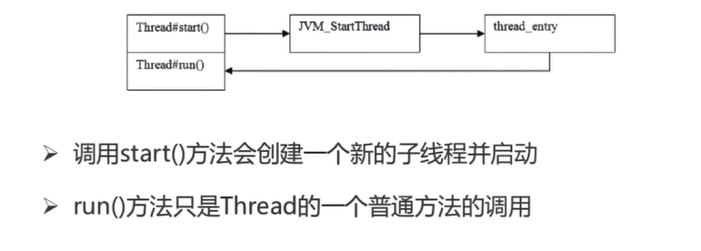
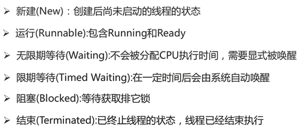
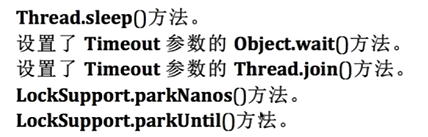
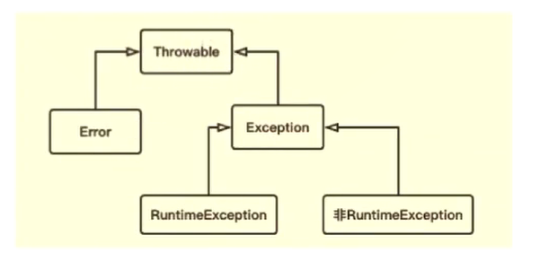
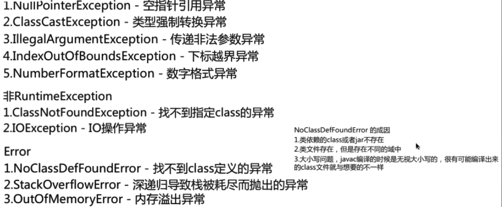
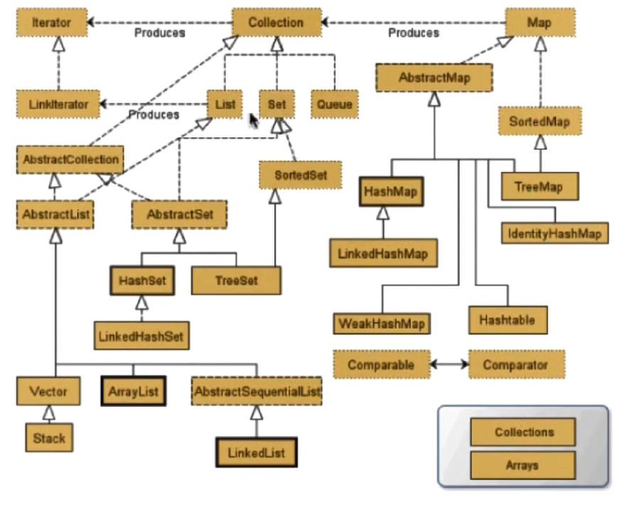
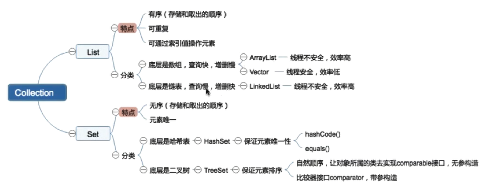
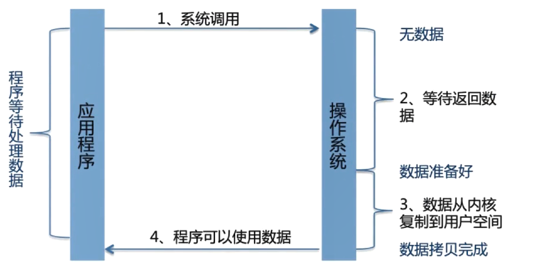
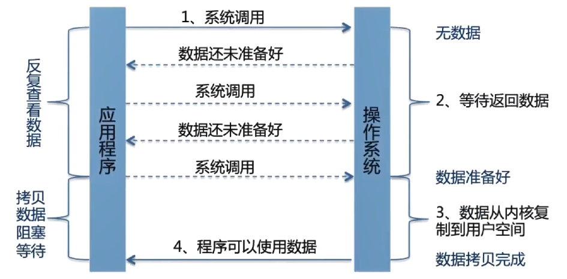
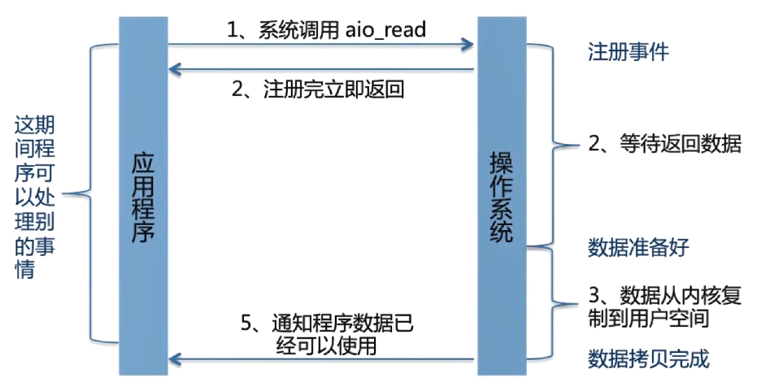

# 前言

本文主要包含 Java 核心基础知识，主要根据以下部分进行节选，选择了个人认为在面试中最为核心的部分。

## JAVA的理解

- 平台无关性：一次编译，到处运行
- GC：不必像C++一样主动释放堆内存
- 语言特性：泛型、反射、 lambda 表达式
- 面向对象：封装、继承、多态
- 类库：java本身自带的集合、并发库、网络库等等
- 异常处理

**平台无关性如何实现：**

编写一个Java文件即源代码----经过Javac编译生成字节码保存在.class文件---jvm解析，转换成特定平台的执行指令。

**JVM如何加载.class文件：**

- Class Loader：依据特斯那个格式，加载class文件到内存
- Execution Engine：对命令进行解析
- Native Interface：融合不同开发语言的原生库为java所用

**反射：**

java反射机制是在运行状态中，对于任意一个类，都能够知道这个类的所有属性和方法；对于任意一个对象，都能够调用它的任意方法和属性；这种动态获取信息以及动态调用对象方法的功能称为java语言的反射机制。

```java
import java.lang.reflect.Constructor;
import java.lang.reflect.Field;
import java.lang.reflect.Method;
import java.util.Arrays;
 
public class Test01 {
    public static void main(String[] args) throws ClassNotFoundException {
        String a = "java.lang.String";
//        String a = "java.lang.HashMap";
 
        // 根据一类的全名字符串来获得一个类的类对象
        //Class这个类用于操纵（反向解析）一个类的属性，方法，构造器等
        Class<?> clazz = Class.forName(a);
        // 获得传递过来的类的所有方法
        Method[] methods = clazz.getDeclaredMethods();
//        String s = Arrays.toString(methods);
        for (Method m: methods) {
            System.out.println(m);
        }
        System.out.println("------------------------------------------");
        // 获得类的所有属性
        Field[] declaredFields = clazz.getDeclaredFields();
        for(Field d : declaredFields) {
            System.out.println(d);
        }
        System.out.println("-------------------------------------");
        // 获得类的所有构造器
        Constructor<?>[] constructors = clazz.getDeclaredConstructors();
        for (Constructor c : constructors) {
            System.out.println(c);
        }
    }
}
```

*注：访问private类型的要通过 变量.setAccessible(true) 来获取；public类型不需要。*

**ClassLoader：**

ClassLoader在java中有着非常重要的作用，它主要工作在class装载的加载阶段，其主要作用是从系统外部获得class二进制数据流，所有的class都是由ClassLoader进行加载的，ClassLoader负责通过将class文件里的二进制数据流装载进系统，然后交给java虚拟机进行连接、初始化等操作。

**loadClass和forName的区别：**

  

```
Class.forName(className)方法，内部实际调用的方法是 Class.forName(className,true,classloader); 
```

第2个boolean参数表示类是否需要初始化， Class.forName(className)默认是需要初始化。

一旦初始化，就会触发目标对象的 static块代码执行，static参数也会被再次初始化。

```
ClassLoader.loadClass(className)方法，内部实际调用的方法是ClassLoader.loadClass(className,false);
```

第2个 boolean参数，表示目标对象是否进行链接，false表示不进行链接，由上面介绍可以，不进行链接意味着不进行包括初始化等一些列步骤，那么静态块和静态对象就不会得到执行

Class.forName()除了将类的.class文件加载到JVM中之外，还会对类进行解释，执行类中的static块。
而classLoader只干一件事情，就是将.class文件加载到JVM中，不会执行static中的内容,只有在newInstance才会去执行static块。

Class.forName(name, initialize, loader)带参函数也可控制是否加载static块。并且只有调用了newInstance()方法才用调用构造函数，创建类的对象。

## 泛型

- 让我们的数据结构可以放置“任何”数据类型

- 不可以是基本数据类型，只能是类对象

  boolean，byte，char，short，int，long，float，double

- 每个基本数据类型都有对应的包装类

  Boolean，Byte，Character，Short，Int，Long，Float，Double

## GC 垃圾回收机制

**判断对象是否为垃圾的算法：**

- **引用计数法：**通过判断对象的引用数量来决定对象是否可以被回收；每个对象实例都有一个计数器，被引用+1，完成引用-1；任何引用计数为0的实例可以被当作垃圾收集。

  **优点：**执行效率高，程序执行受影响较小。

  **缺点：**无法检测出循环引用的情况，导致内存泄漏：循环引用（父类子类相互引用）。

- **可达性分析算法：**从GC Root开始，判断对象引用链是否可达。

**垃圾回收算法：**

- **标记-清除算法：**

  标记：从根集合进行扫描，对存活对象进行标记。

  清除：对堆内存从头到尾进行线性遍历，回收不可达对象内存。

  缺点：不需要移动，只需要清除不存活的对象，会产生大量不连续的内存碎片，会导致日后运行需要较大内存时无法找到足够的连续内存而不得不提前触发另一次垃圾回收工作。

- **复制算法：**

  分为对象面和空闲面，对象主要是在对象面上创建，存活的对象被从对象面复制到空闲面，将对象面的所有对象内存清除。解决碎片化问题，顺序分配内存，简单高效，适用于对象存活率过低的从场景，主要应用于年轻代，年轻代中的回收基本只有10%的对象存活，但不适用于老年代。

- **标记-整理算法：**

  标记：从根集合进行扫描，对存活对象进行标记。

  清除：移动所有存活的对象，且按照内存地址依次排列，然后将末端地址以后的内存全部回收。

  是在标记-清除算法的基础上对对象进行了移动，通过可达性分析算法确定存活对象，再进行移动清除，避免了内存的不连续性，不用设置两块内存互换，适用于存活率高的场景。

- **分代收集算法：**

  垃圾回收算法的组合拳，按照对象生命周期的不同划分区域以采用不同的垃圾回收算法，提高JVM的回收效率；JDK8及其以后版本取消了永久代。

## 强引用、软引用、弱引用、虚引用：


## Gson 处理 JSON

Gson 是谷歌开源的 Json 解析库，可以方便的将 Java 对象转换成 Json 字符串，也可以方便的将 Json 字符串转换成 Java 对象。

比如有如下 json，分别获取 HeWeather6 里的 status 和 now 里的属性。

```java
{
	"HeWeather6": [{
		"status": "ok",
		"now": {
			"cloud": "91",
			"cond_code": "100",
			"cond_txt": "晴",
			"fl": "17",
			"hum": "58",
			"pcpn": "0.0",
			"pres": "1016",
			"tmp": "18",
			"vis": "19",
			"wind_deg": "13",
			"wind_dir": "东北风",
			"wind_sc": "2",
			"wind_spd": "10"
		}
	}]
}
```

1、当属性比较少时，可以直接访问，如访问 status

```java
JsonObject jsonObj = (JsonObject) new JsonParser().parse(要解析的json);

String status = jsonObj.get("HeWeather6").getAsJsonArray().get(0).getAsJsonObject().get("status").getAsString();
```

2、属性比较多的，建立映射类，如访问 now 里的属性

首先新建名为 Now 的映射类

```java
public class Now {
		private String cloud;
		private String cond_code;
	    private String cond_txt;
	    private String fl;
	    private String hum;
	    private String pcpn;
	    private String pres;
	    private String tmp;
	    private String vis;
	    private String wind_deg;
	    private String wind_dir;
	    private String wind_sc;
	    private String wind_spd;
		public String getCloud() {
			return cloud;
		}
		public void setCloud(String cloud) {
			this.cloud = cloud;
		}
		public String getCond_code() {
			return cond_code;
		}
		public void setCond_code(String cond_code) {
			this.cond_code = cond_code;
		}
		public String getCond_txt() {
			return cond_txt;
		}
		public void setCond_txt(String cond_txt) {
			this.cond_txt = cond_txt;
		}
		public String getFl() {
			return fl;
		}
		public void setFl(String fl) {
			this.fl = fl;
		}
		public String getHum() {
			return hum;
		}
		public void setHum(String hum) {
			this.hum = hum;
		}
		public String getPcpn() {
			return pcpn;
		}
		public void setPcpn(String pcpn) {
			this.pcpn = pcpn;
		}
		public String getPres() {
			return pres;
		}
		public void setPres(String pres) {
			this.pres = pres;
		}
		public String getTmp() {
			return tmp;
		}
		public void setTmp(String tmp) {
			this.tmp = tmp;
		}
		public String getVis() {
			return vis;
		}
		public void setVis(String vis) {
			this.vis = vis;
		}
		public String getWind_deg() {
			return wind_deg;
		}
		public void setWind_deg(String wind_deg) {
			this.wind_deg = wind_deg;
		}
		public String getWind_dir() {
			return wind_dir;
		}
		public void setWind_dir(String wind_dir) {
			this.wind_dir = wind_dir;
		}
		public String getWind_sc() {
			return wind_sc;
		}
		public void setWind_sc(String wind_sc) {
			this.wind_sc = wind_sc;
		}
		public String getWind_spd() {
			return wind_spd;
		}
		public void setWind_spd(String wind_spd) {
			this.wind_spd = wind_spd;
		}
															
}

```

```java
JsonObject jsonObj = (JsonObject) new JsonParser().parse(要解析的json);

JsonObject nowStr = (JsonObject) jsonObj.get("HeWeather6").getAsJsonArray().get(0).getAsJsonObject().get("now");

Now now = new Gson().fromJson(nowStr.toString(), Now.class);
```

## 内存模型

线程私有：

- 程序计数器——当前线程所执行的字节码行号指示器；改变计数器的值来选取下一条需要执行的字节码指令；和线程是一对一的关系即“线程私有”；对java方法计数，如果是Native方法则计数器值为undefined；只是记录行号，不会发生内存泄漏的问题。
- 虚拟机栈——java方法执行的内存模型，每个方法被执行时都会创建一个栈帧，即方法运行期间的基础数据结构
- 本地方法栈

线程共享：MetaSpace、Java堆

## 线程

### **Thread中run和start方法的区别：**



### **Thread和Runnable的关系：**

#### **Thread实例**

MyThread类

```java
public class MyThread extends Thread{
	private String name;
	public MyThread(String name) {
		this.name = name;
	}
	
	public void run() {
		for (int i=0;i<5;i++) {
			System.out.println("Thread start:"+this.name+i);
		}
	}
}
```

ThreadDemo类

```java
public class ThreadDemo {
	public static void main(String[] args) {
		MyThread mt1 = new MyThread("gzh");
		MyThread mt2 = new MyThread("rjy");
		MyThread mt3 = new MyThread("r&g");
		System.out.println("调用run方法：");
		mt1.run();
		mt2.run();
		mt3.run();
		System.out.println("调用start方法：");
		mt1.start();
		mt2.start();
		mt3.start();
	}
}
```

运行结果：可知单独调用run只是普通的方法，start才会去调用线程

```
调用run方法：
Thread start:gzh0
Thread start:gzh1
Thread start:gzh2
Thread start:gzh3
Thread start:gzh4
Thread start:rjy0
Thread start:rjy1
Thread start:rjy2
Thread start:rjy3
Thread start:rjy4
Thread start:r&g0
Thread start:r&g1
Thread start:r&g2
Thread start:r&g3
Thread start:r&g4
调用start方法：
Thread start:gzh0
Thread start:gzh1
Thread start:gzh2
Thread start:gzh3
Thread start:rjy0
Thread start:rjy1
Thread start:rjy2
Thread start:rjy3
Thread start:rjy4
Thread start:r&g0
Thread start:r&g1
Thread start:r&g2
Thread start:r&g3
Thread start:gzh4
Thread start:r&g4
```

#### **Runable实例**

MyRunable类

```java
public class MyRunable implements Runnable{

	private String name;
	public MyRunable(String name) {
		this.name = name;
	}
	/* (non-Javadoc)
	 * @see java.lang.Runnable#run()
	 */
	@Override
	public void run() {
		// TODO Auto-generated method stub
		for (int i=0;i<5;i++) {
			System.out.println("Thread start:"+this.name+i);
		}
	}
}
```

RunableDemo类

```java
public class RunableDemo {
	public static void main(String[] args) {
		System.out.println("调用run方法：");
		MyRunable mr1 = new MyRunable("gzh");
		MyRunable mr2 = new MyRunable("rjy");
		MyRunable mr3 = new MyRunable("r&g");
		//这样只能调用run方法
		mr1.run();
		mr2.run();
		mr3.run();
		
		System.out.println("调用start方法：");
		Thread t1 = new Thread(mr1);
		Thread t2 = new Thread(mr2);
		Thread t3 = new Thread(mr3);
		t1.start();
		t2.start();
		t3.start();
	}
}
```

## **处理线程的返回值：**

- 主线程等待法：wait（）
- 使用Thread类的join（）阻塞当前线程以等待子线程处理完毕
- 通过Callable接口实现，通过Future or 线程池获取

### **Future实例**

MyCallable类

```java
public class MyCallable implements Callable{
	@Override
	public Object call() throws Exception {
		String value = "gzh";
		System.out.println("ready to work");
		Thread.currentThread().sleep(5000);
		System.out.println("task done");
		return value;
	}
}
```

FutrueTaskDemo类

```java
public class FutrueTaskDemo {
	public static void main(String[] args) throws InterruptedException, ExecutionException {
		FutureTask ft = new FutureTask(new MyCallable());
		new Thread(ft).start();
		if(!ft.isDone()) {
			System.out.println("task has not finally");
		}
		System.out.println("task return:"+ft.get());
	}
}
```

运行结果：

```
task has not finally
ready to work
（等待五秒）
task done
task return:gzh
```

### **线程池实例**

ThreadPoolDemo类

```java
public class ThreadPoolDemo {
	public static void main(String[] args) throws InterruptedException, ExecutionException {
		ExecutorService newCachedThreadPool = Executors.newCachedThreadPool();
		Future ft = newCachedThreadPool.submit(new MyCallable());
		if(!ft.isDone()) {
			System.out.println("task has not finally");
		}
		System.out.println("task return:"+ft.get());
	}
}
```

运行结果：

```
task has not finally
ready to work
（等待五秒）
task done
task return:gzh
```

结论：线程池可以提交多个实现callable方法的类，去让线程池并发的处理结果，方便对执行callable的类统一进行管理。

## **线程状态：**



无限期等待：


限期等待：



## **sleep和wait的区别：**

**基本差别：**

- sleep是Thread类的方法，wait是Object类中定义的方法
- sleep方法可以在任何地方使用
- wait方法只能在synchronized方法或synchronized块中使用

**本质差别：**

- sleep只会让出CPU，不会导致锁行为的改变
- wait不仅让出CPU，还会释放出已经占有的同步资源锁

## notify 唤醒

 **锁池和等待池**

- 锁池:假设线程A已经拥有了某个对象(注意:不是类)的锁，而其它的线程想要调用这个对象的某个synchronized方法(或者synchronized块)，由于这些线程在进入对象的synchronized方法之前必须先获得该对象的锁的拥有权，但是该对象的锁目前正被线程A拥有，所以这些线程就进入了该对象的锁池中。
- 等待池:假设一个线程A调用了某个对象的wait()方法，线程A就会释放该对象的锁后，进入到了该对象的等待池中

 **notify和notifyAll区别：**

- 如果线程调用了对象的 wait()方法，那么线程便会处于该对象的等待池中，等待池中的线程不会去竞争该对象的锁。
- 当有线程调用了对象的 notifyAll()方法（唤醒所有 wait 线程）或 notify()方法（只随机唤醒一个 wait 线程），被唤醒的的线程便会进入该对象的锁池中，锁池中的线程会去竞争该对象锁。也就是说，调用了notify后只要一个线程会由等待池进入锁池，而notifyAll会将该对象等待池内的所有线程移动到锁池中，等待锁竞争。
- 优先级高的线程竞争到对象锁的概率大，假若某线程没有竞争到该对象锁，它还会留在锁池中，唯有线程再次调用 wait()方法，它才会重新回到等待池中。而竞争到对象锁的线程则继续往下执行，直到执行完了 synchronized 代码块，它会释放掉该对象锁，这时锁池中的线程会继续竞争该对象锁。

**实例**

MyNotify类

```java
public class MyNotify extends Thread {

	private String name;
	private Object obj;

	public MyNotify(String name, Object obj) {
		this.name = name;
		this.obj = obj;
	}

	public void run() {
		System.out.println(name + " is waiting.");

		try {
			synchronized (obj) {
				obj.wait();
				System.out.println(name + " is wait.");
			}
			System.out.println(name + " has been notified.");
		} catch (InterruptedException e) {
			e.printStackTrace();
		}

	}
}
```

WaitAndNotify类

```java
public class WaitAndNotify {
	public static void main(String[] args) {
		Object obj = new Object();
		System.out.println(obj);
		for (int i = 0; i < 5; i++) {
			MyNotify t = new MyNotify("Thread" + i, obj);
			t.start();
		}

		try {
			TimeUnit.SECONDS.sleep(2);
			System.out.println("-----Main Thread notify-----");
			synchronized (obj) {
				obj.notify();
			}

			TimeUnit.SECONDS.sleep(2);
			System.out.println("Main Thread is end.");

		} catch (InterruptedException e) {
			e.printStackTrace();
		}

	}
}
```

运行结果

```
java.lang.Object@1540e19d
Thread1 is waiting.
Thread2 is waiting.
Thread0 is waiting.
Thread3 is waiting.
Thread4 is waiting.
-----Main Thread notify-----
Thread1 has been notified.
Main Thread is end.
 
将其中的那个notify换成notifyAll，运行结果：
Thread0 is waiting.
Thread1 is waiting.
Thread2 is waiting.
Thread3 is waiting.
Thread4 is waiting.
-----Main Thread notifyAll-----
Thread4 has been notified.
Thread2 has been notified.
Thread1 has been notified.
Thread3 has been notified.
Thread0 has been notified.
Main Thread is end.

运行环境jdk8，结论：
notify唤醒一个等待的线程；notifyAll唤醒所有等待的线程。
```


## **yield让出CPU**

当前调用Thread.yield()函数时，会给线程调度器一个当前线程愿意让出CPU使用的暗示， 让其他或者自己的线程执行（也就是谁先抢到谁执行） ,但是线程调度器可能会忽略这个暗示。

实例：

```
public class YieldDemo {
	
	public static void main(String[] args) {
		Runnable yield = new Runnable() {

			@Override
			public void run() {
				for(int i=0;i<20;i++) {
					System.out.println(Thread.currentThread().getName()+i);
					if(i==5) {
						Thread.yield();
					}
				}
				
			}
			
		};
		Thread t1 = new Thread(yield,"A");
		Thread t2 = new Thread(yield,"B");
		Thread t3 = new Thread(yield,"C");
		t1.start();
		t2.start();
		t3.start();
	}
}
```

运行结果

```
B0
B1
B2
B3
B4
B5
C0
C1
C2
C3
C4
C5
A0
A1
A2
C6
A3
A4
A5
B6
B7
B8
B9
B10
B11
A6
A7
A8
A9
C7
A10
A11
A12
A13
A14
A15
A16
B12
A17
C8
C9
C10
C11
C12
C13
A18
A19
B13
C14
B14
C15
C16
C17
B15
B16
B17
C18
B18
B19
C19

```

## **interrupt中断线程：**

- 通过调用stop方法停止线程（太暴力，已被抛弃）
- 调用interrupt，通知线程应该中断了（目前使用）
  - 如果线程处于被阻塞状态，那么线程将立即退出被阻塞状态，并抛出InterruptedException异常
  - 如果线程处于正常活动状态，那么会将该线程的中断标志设置为true。被设置中断标志的线程将继续正常运行，不受影响

中断在java中主要有3个方法，interrupt()，isInterrupted()和interrupted()。

- interrupt()，在一个线程中调用另一个线程的interrupt()方法，即会向那个线程发出信号——线程中断状态已被设置。至于那个线程何去何从，由具体的代码实现决定。
- isInterrupted()，用来判断当前线程的中断状态(true or false)。
- interrupted()是个Thread的static方法，用来恢复中断状态。

 **interrupt()不能中断在运行中的线程，它只能改变中断状态而已。** 

```java
public class InterruptionInJava implements Runnable{
 
    public static void main(String[] args) throws InterruptedException {
        Thread testThread = new Thread(new InterruptionInJava(),"InterruptionInJava");
       //start thread,准备开始执行run方法
        testThread.start();
       //给程序执行run方法的时间，避免还没执行run方法，就先执行 on = true; 这样while不会执行
        Thread.sleep(1000);
        //interrupt thread
        testThread.interrupt();
 
        System.out.println("main end");
 
    }
 
    @Override
    public void run() {
        while(true){
            if(Thread.currentThread().isInterrupted()){
                System.out.println("Yes,I am interruted,but I am still running");
 
            }else{
                System.out.println("not yet interrupted");
            }
        }
    }
}
```

运行结果：

```
  System.out.println("main end");
  System.out.println("not yet interrupted");
  .......
  (1秒后)
  System.out.println("Yes,I am interruted,but I am still running");
  .......
```

 **如何中断线程？答案是添加一个开关**。 

```java
public class InterruptionInJava implements Runnable{
    private volatile static boolean on = false;
    public static void main(String[] args) throws InterruptedException {
        Thread testThread = new Thread(new InterruptionInJava(),"InterruptionInJava");
       //start thread,准备开始执行run方法
        testThread.start();
        //给程序执行run方法的时间，避免还没执行run方法，就先执行 on = true; 这样while不会执行
        Thread.sleep(1000);
        testThread.interrupt();
        InterruptionInJava.on = true;
 
        System.out.println("main end");
 
    }
 
    @Override
    public void run() {
        while(!on){
            if(Thread.currentThread().isInterrupted()){
                System.out.println("Yes,I am interruted,but I am still running");
                //或者在这里添加 return;
            }else{
                System.out.println("not yet interrupted");
            }
        }
    }
}
```

运行结果：

```
not yet interrupted
......
main end
Yes,I am interruted,but I am still running
```

 **但是当遇到线程阻塞时，就会很无奈了，正如下面代码所示：** 

```java
public class InterruptionInJava implements Runnable{
    private volatile static boolean on = false;
    public static void main(String[] args) throws InterruptedException {
        Thread testThread = new Thread(new InterruptionInJava(),"InterruptionInJava");
        //start thread,准备开始执行run方法
        testThread.start();
       //给程序执行run方法的时间，避免还没执行run方法，就先执行 on = true; 这样while不会执行
        Thread.sleep(1000);
        InterruptionInJava.on = true;
        
        System.out.println("main end");
    }
 
    @Override
    public void run() {
        while(!on){
        	try {
				Thread.sleep(10000000);
			} catch (InterruptedException e) {
				// TODO Auto-generated catch block
				System.out.println("caught exception: "+e);
			}
        }
    }
}
```

运行结果

```
main end
（一直在阻塞）
```

 **线程被阻塞无法被中断。这时候救世主interrupt函数又回来了，它可以迅速中断被阻塞的线程，抛出一个InterruptedException，把线程从阻塞状态中解救出来 ：**

```java
public class InterruptionInJava implements Runnable{
    private volatile static boolean on = false;
    public static void main(String[] args) throws InterruptedException {
        Thread testThread = new Thread(new InterruptionInJava(),"InterruptionInJava");
        //start thread,准备开始执行run方法
        testThread.start();
        Thread.sleep(1000);//避免还没执行run方法，就先执行 on = true; 这样while不会执行
        InterruptionInJava.on = true;
        testThread.interrupt();
        System.out.println("main end");
    }
 
    @Override
    public void run() {
        while(!on){
        	try {
				Thread.sleep(10000000);
			} catch (InterruptedException e) {
				// TODO Auto-generated catch block
				System.out.println("caught exception: "+e);
			}
        }
    }
}
```

运行结果

```
main end
caught exception: java.lang.InterruptedException: sleep interrupted
```

## 异常

**异常体系**



**Error和Exception的区别**

- Error：程序无法处理的系统错误，编译器不做检查
- Exception：程序可以处理的异常，捕获后可能恢复

**常见异常**



**try-catch的性能**

- try-catch块影响JVM的优化
- 异常对象实例需要保存栈快照等信息，开销较大

## 集合

**数据结构考点：**


**算法考点：**


**哪些排序不稳定？**

快排、堆排

**如何优化算法？**

以空间换时间

**JAVA集合框架：**



**List和Set的比较：**



## J.U.C

## IO机制

- BIO——Block-IO：InputStream和Output Stream，Reader和Writer



- NIO——Nonblock-IO：构建多路复用的，同步非阻塞的IO操作



- AIO——Asyhchronous IO：基于事件和回调机制

