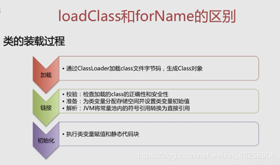
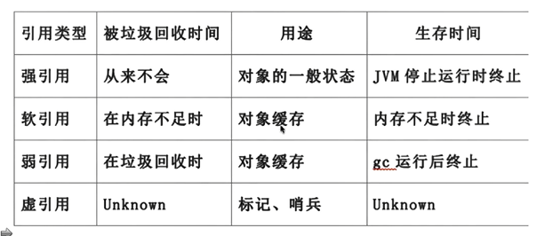

# 前言

本文主要包含 Java 核心基础知识，主要根据以下部分进行节选，选择了个人认为在面试中最为核心的部分。

## JAVA的理解

- 平台无关性：一次编译，到处运行
- GC：不必像C++一样主动释放堆内存
- 语言特性：泛型、反射、 lambda 表达式
- 面向对象：封装、继承、多态
- 类库：java本身自带的集合、并发库、网络库等等
- 异常处理

**平台无关性如何实现：**

编写一个Java文件即源代码----经过Javac编译生成字节码保存在.class文件---jvm解析，转换成特定平台的执行指令。

**JVM如何加载.class文件：**

- Class Loader：依据特斯那个格式，加载class文件到内存
- Execution Engine：对命令进行解析
- Native Interface：融合不同开发语言的原生库为java所用

**反射：**

java反射机制是在运行状态中，对于任意一个类，都能够知道这个类的所有属性和方法；对于任意一个对象，都能够调用它的任意方法和属性；这种动态获取信息以及动态调用对象方法的功能称为java语言的反射机制。

```java
import java.lang.reflect.Constructor;
import java.lang.reflect.Field;
import java.lang.reflect.Method;
import java.util.Arrays;
 
public class Test01 {
    public static void main(String[] args) throws ClassNotFoundException {
        String a = "java.lang.String";
//        String a = "java.lang.HashMap";
 
        // 根据一类的全名字符串来获得一个类的类对象
        //Class这个类用于操纵（反向解析）一个类的属性，方法，构造器等
        Class<?> clazz = Class.forName(a);
        // 获得传递过来的类的所有方法
        Method[] methods = clazz.getDeclaredMethods();
//        String s = Arrays.toString(methods);
        for (Method m: methods) {
            System.out.println(m);
        }
        System.out.println("------------------------------------------");
        // 获得类的所有属性
        Field[] declaredFields = clazz.getDeclaredFields();
        for(Field d : declaredFields) {
            System.out.println(d);
        }
        System.out.println("-------------------------------------");
        // 获得类的所有构造器
        Constructor<?>[] constructors = clazz.getDeclaredConstructors();
        for (Constructor c : constructors) {
            System.out.println(c);
        }
    }
}
```

*注：访问private类型的要通过 变量.setAccessible(true) 来获取；public类型不需要。*

**ClassLoader：**

ClassLoader在java中有着非常重要的作用，它主要工作在class装载的加载阶段，其主要作用是从系统外部获得class二进制数据流，所有的class都是由ClassLoader进行加载的，ClassLoader负责通过将class文件里的二进制数据流装载进系统，然后交给java虚拟机进行连接、初始化等操作。

**loadClass和forName的区别：**

  

```
Class.forName(className)方法，内部实际调用的方法是 Class.forName(className,true,classloader); 
```

第2个boolean参数表示类是否需要初始化， Class.forName(className)默认是需要初始化。

一旦初始化，就会触发目标对象的 static块代码执行，static参数也会被再次初始化。

```
ClassLoader.loadClass(className)方法，内部实际调用的方法是ClassLoader.loadClass(className,false);
```

第2个 boolean参数，表示目标对象是否进行链接，false表示不进行链接，由上面介绍可以，不进行链接意味着不进行包括初始化等一些列步骤，那么静态块和静态对象就不会得到执行

Class.forName()除了将类的.class文件加载到JVM中之外，还会对类进行解释，执行类中的static块。
而classLoader只干一件事情，就是将.class文件加载到JVM中，不会执行static中的内容,只有在newInstance才会去执行static块。

Class.forName(name, initialize, loader)带参函数也可控制是否加载static块。并且只有调用了newInstance()方法才用调用构造函数，创建类的对象。

## GC 垃圾回收机制

**判断对象是否为垃圾的算法：**

- **引用计数法：**通过判断对象的引用数量来决定对象是否可以被回收；每个对象实例都有一个计数器，被引用+1，完成引用-1；任何引用计数为0的实例可以被当作垃圾收集。

  **优点：**执行效率高，程序执行受影响较小。

  **缺点：**无法检测出循环引用的情况，导致内存泄漏：循环引用（父类子类相互引用）。

- **可达性分析算法：**从GC Root开始，判断对象引用链是否可达。

**垃圾回收算法：**

- **标记-清除算法：**

  标记：从根集合进行扫描，对存活对象进行标记。

  清除：对堆内存从头到尾进行线性遍历，回收不可达对象内存。

  缺点：不需要移动，只需要清除不存活的对象，会产生大量不连续的内存碎片，会导致日后运行需要较大内存时无法找到足够的连续内存而不得不提前触发另一次垃圾回收工作。

- **复制算法：**

  分为对象面和空闲面，对象主要是在对象面上创建，存活的对象被从对象面复制到空闲面，将对象面的所有对象内存清除。解决碎片化问题，顺序分配内存，简单高效，适用于对象存活率过低的从场景，主要应用于年轻代，年轻代中的回收基本只有10%的对象存活，但不适用于老年代。

- **标记-整理算法：**

  标记：从根集合进行扫描，对存活对象进行标记。

  清除：移动所有存活的对象，且按照内存地址依次排列，然后将末端地址以后的内存全部回收。

  是在标记-清除算法的基础上对对象进行了移动，通过可达性分析算法确定存活对象，再进行移动清除，避免了内存的不连续性，不用设置两块内存互换，适用于存活率高的场景。

- **分代收集算法：**

  垃圾回收算法的组合拳，按照对象生命周期的不同划分区域以采用不同的垃圾回收算法，提高JVM的回收效率；JDK8及其以后版本取消了永久代。

## 强引用、软引用、弱引用、虚引用：



## Gson 处理 JSON

Gson 是谷歌开源的 Json 解析库，可以方便的将 Java 对象转换成 Json 字符串，也可以方便的将 Json 字符串转换成 Java 对象。

比如有如下 json，分别获取 HeWeather6 里的 status 和 now 里的属性。

```java
{
	"HeWeather6": [{
		"status": "ok",
		"now": {
			"cloud": "91",
			"cond_code": "100",
			"cond_txt": "晴",
			"fl": "17",
			"hum": "58",
			"pcpn": "0.0",
			"pres": "1016",
			"tmp": "18",
			"vis": "19",
			"wind_deg": "13",
			"wind_dir": "东北风",
			"wind_sc": "2",
			"wind_spd": "10"
		}
	}]
}
```

1、当属性比较少时，可以直接访问，如访问 status

```java
JsonObject jsonObj = (JsonObject) new JsonParser().parse(要解析的json);

String status = jsonObj.get("HeWeather6").getAsJsonArray().get(0).getAsJsonObject().get("status").getAsString();
```

2、属性比较多的，建立映射类，如访问 now 里的属性

首先新建名为 Now 的映射类

```java
public class Now {
		private String cloud;
		private String cond_code;
	    private String cond_txt;
	    private String fl;
	    private String hum;
	    private String pcpn;
	    private String pres;
	    private String tmp;
	    private String vis;
	    private String wind_deg;
	    private String wind_dir;
	    private String wind_sc;
	    private String wind_spd;
		public String getCloud() {
			return cloud;
		}
		public void setCloud(String cloud) {
			this.cloud = cloud;
		}
		public String getCond_code() {
			return cond_code;
		}
		public void setCond_code(String cond_code) {
			this.cond_code = cond_code;
		}
		public String getCond_txt() {
			return cond_txt;
		}
		public void setCond_txt(String cond_txt) {
			this.cond_txt = cond_txt;
		}
		public String getFl() {
			return fl;
		}
		public void setFl(String fl) {
			this.fl = fl;
		}
		public String getHum() {
			return hum;
		}
		public void setHum(String hum) {
			this.hum = hum;
		}
		public String getPcpn() {
			return pcpn;
		}
		public void setPcpn(String pcpn) {
			this.pcpn = pcpn;
		}
		public String getPres() {
			return pres;
		}
		public void setPres(String pres) {
			this.pres = pres;
		}
		public String getTmp() {
			return tmp;
		}
		public void setTmp(String tmp) {
			this.tmp = tmp;
		}
		public String getVis() {
			return vis;
		}
		public void setVis(String vis) {
			this.vis = vis;
		}
		public String getWind_deg() {
			return wind_deg;
		}
		public void setWind_deg(String wind_deg) {
			this.wind_deg = wind_deg;
		}
		public String getWind_dir() {
			return wind_dir;
		}
		public void setWind_dir(String wind_dir) {
			this.wind_dir = wind_dir;
		}
		public String getWind_sc() {
			return wind_sc;
		}
		public void setWind_sc(String wind_sc) {
			this.wind_sc = wind_sc;
		}
		public String getWind_spd() {
			return wind_spd;
		}
		public void setWind_spd(String wind_spd) {
			this.wind_spd = wind_spd;
		}
															
}

```

```java
JsonObject jsonObj = (JsonObject) new JsonParser().parse(要解析的json);

JsonObject nowStr = (JsonObject) jsonObj.get("HeWeather6").getAsJsonArray().get(0).getAsJsonObject().get("now");

Now now = new Gson().fromJson(nowStr.toString(), Now.class);
```
