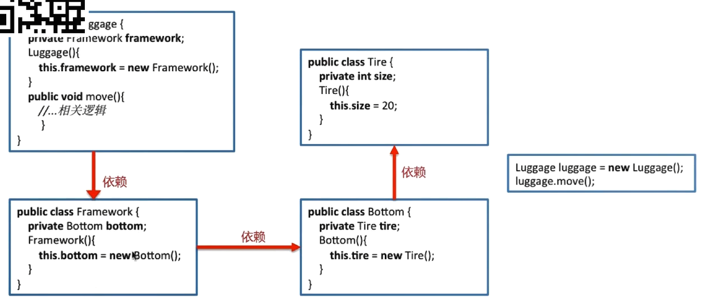

# Spring

## IOC（inversion of control）：控制反转

依赖注入（Depenency Inversion）

含义：把底层类作为参数传递给上层类，实现上层堆下层的“控制”

DI举例：设计行李箱

**上层建筑依赖下层建筑：**


对应代码场景：



如果将轮子size改为动态


**下层建筑依赖上层建筑：**


对应代码场景：


如果将轮子size改为动态


IOC容器的优势：

- 避免在各处使用new来创建类，并且可以做到统一维护
- 创建实例的时候不需要了解其中的细节

**Spring Boot的IOC实现方式：**

- **通过@Bean和@Configuration**

  实体类

  ```java
  public class Person {
  	private String name;
  	private int id;
  	public String getName() {
  		return name;
  	}
  	public void setName(String name) {
  		this.name = name;
  	}
  	public int getId() {
  		return id;
  	}
  	public void setId(int id) {
  		this.id = id;
  	}
  }
  ```

  配置类

  ```java
  @Configuration
  public class ApplicationContext {
  	@Bean(name="person")
  	public Person initPerson() {
  		Person person = new Person();
  		person.setId(1);
  		person.setName("Jack");
  		return person;
  	}
  }
  ```

- **通过扫描装配Bean**

  给实体类加上@Component("person")注解

  *给启动类加上@ComponentScan（@SpringBootApplication注解已包含@ComponentScan）*

**Spring Bean的作用域：**


**Spring Bean的生命周期：**

创建过程


销毁过程


## AOP 面向切面编程

关注点分离：不同问题交给不同的部分去解决

AOP的三种织入方式：


**编程实例：**

新建web类

```java
@RestController
public class TestController {
	
	@ResponseBody
	@RequestMapping(value = "hello",method = RequestMethod.GET)
	public String hello(String name) {
		return name;
	}

}
```

新建切面类

```java
@Aspect
@Component
public class RequestLogAspect {
	private static final Logger logger = LoggerFactory.getLogger(RequestLogAspect.class);
	
	@Pointcut("execution(public * com.bigdata.java.web..*.*(..))")
	public void webLog() {}
	
	@Before("webLog()")
	public void doBefore(JoinPoint joinPoint) {
		//记录请求内容
		logger.info("logger 开始了");
	}
	
	
	@AfterReturning(returning ="ret" ,pointcut="webLog()")//只能写ret，写其他会启动报错
	public void doAfter(Object ret) {
		logger.info("response: " + ret);
	}
}
```

*需要依赖 spring-boot-starter-aop jar包*

浏览器访问

```
http://localhost:8080/hello?name=aa
```

后台打印

```
2019-12-02 16:36:31.772  INFO 17976 --- [nio-8080-exec-1] com.bigdata.java.aop.RequestLogAspect    : logger 开始了
2019-12-02 16:36:31.778  INFO 17976 --- [nio-8080-exec-1] com.bigdata.java.aop.RequestLogAspect    : response: aa
```

