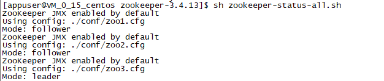

# 安装

## **单机伪分布式搭建**

版本：zookeeper-3.4.13.tar.gz

步骤：

1. 解压：tar zvxf zookeeper-3.4.13.tar.gz

2.  进入zookeeper-3.4.13/conf/目录下，将改目录下的zoo_sample.cfg配置文件拷贝4份，依次为zoo.cfg、zoo1.cfg、 zoo2.cfg、zoo3.cfg 

3.  使用vim编辑zoo1.cfg配置文件 

   ```
   clientPort=2181
   
   dataDir=/home/appuser/zookeeper/zookeeper-3.4.13/server1/data
   dataLogDir=/home/appuser/zookeeper/zookeeper-3.4.13/server1/logs
   
   #因为单机所以都是127.0.0.1，如果非单机则除了本机是127.0.0.1，其他为各自服务器对应的ip地址
   server.1=127.0.0.1:3181:4181
   server.2=127.0.0.1:3182:4182
   server.3=127.0.0.1:3183:4183
   ```

   使用vim编辑zoo2.cfg配置文件 

   ```
   clientPort=2182
   
   dataDir=/home/appuser/zookeeper/zookeeper-3.4.13/server2/data
   dataLogDir=/home/appuser/zookeeper/zookeeper-3.4.13/server2/logs
   
   #因为单机所以都是127.0.0.1，如果非单机则除了本机是127.0.0.1，其他为各自服务器对应的ip地址
   server.1=127.0.0.1:3181:4181
   server.2=127.0.0.1:3182:4182
   server.3=127.0.0.1:3183:4183
   ```

   使用vim编辑zoo3.cfg配置文件 

   ```
   clientPort=2183
   
   dataDir=/home/appuser/zookeeper/zookeeper-3.4.13/server3/data
   dataLogDir=/home/appuser/zookeeper/zookeeper-3.4.13/server3/logs
   
   #因为单机所以都是127.0.0.1，如果非单机则除了本机是127.0.0.1，其他为各自服务器对应的ip地址
   server.1=127.0.0.1:3181:4181
   server.2=127.0.0.1:3182:4182
   server.3=127.0.0.1:3183:4183
   ```

    *dataDir、dataLogDir目录开始不存在，需要手动创建* 

4. 进入zookeeper-3.4.13/目录下

   ```
   mkdir server1
   mkdir server2
   mkdir server3
   
   cd server1
   mkdir data
   mkdir logs
   cd data
   echo 1 > myid
   
   cd server2
   mkdir data
   mkdir logs
   cd data
   echo 2 > myid
   
   cd server3
   mkdir data
   mkdir logs
   cd data
   echo 3 > myid
   ```

5. 在zookeeper-3.4.13/ 下 vi zookeeper-start-all.sh ，一键启动zookeeper集群

   ```
   ./bin/zkServer.sh start-foreground ./conf/zoo1.cfg &
   ./bin/zkServer.sh start-foreground ./conf/zoo2.cfg &
   ./bin/zkServer.sh start-foreground ./conf/zoo3.cfg &
   ```

   *全部启动完再查看状态，单个启动查看的话可能会报错：*

   *Cannot open channel to x at election address*

   *只要在全部启动之后，在报错的节点执行：./bin/zkServer.sh restart ./conf/zoo*.cfg &*

6. 在zookeeper-3.4.13/ 下 vi zookeeper-start-all.sh ，一键查看zookeeper集群状态

   ```
   ./bin/zkServer.sh status ./conf/zoo1.cfg
   ./bin/zkServer.sh status ./conf/zoo2.cfg
   ./bin/zkServer.sh status ./conf/zoo3.cfg
   ```

测试成功如下图：



**注意：要确保2181~2183、3181~3183、4181~4183能成功联通。**