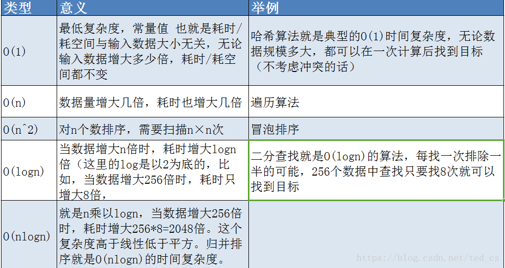

## O(1), O(n), O(logn), O(nlogn) 的区别



## 索引

**为什么需要索引：**快速查询数据。

**什么样的信息能成为索引：**主键、唯一键以及普通键。

**索引的数据结构：**

- 生成索引，建立二叉查找树进行二分查找
- 生成索引，建立B-Tree结构进行查找
- 生成索引，建立B+Tree结构进行查找
- 生成索引，建立Hash结构进行查找

**密集索引和稀疏索引的区别：**

- 密集索引文件中的每个搜索码值都对应一个索引值
- 稀疏索引文件只为索引码的某些值建立索引项

InnoDB：若一个主键被定义，该主键则作为密集索引；若没有主键被定义，该表的第一个唯一非空索引则作为密集索引；若不满足以上条件，innodb内部会生成一个隐藏主键（密集索引）

**索引越多与好？**

- 数据量小的表不需要建立索引，建立会增加额外的索引开销
- 数据变更需要维护索引，因此更多的索引意味着更多的维护成本
- 更多的索引意味着需要更多的空间

## 锁模块

**MyISAM与InnoDB关于锁方面的区别是什么：**

- MyISAM默认用的是表级锁，不支持行级锁
- InnoDB默认用的是行级锁，也支持表级锁

**MyISAM引擎，MyISAM读操作时会给表加表级的读锁（共享锁），写操作时会给表加表级的写锁（排斥锁）：**

- 当对一张表的1~10行进行读操作时，同时对这张表的10行以外的数据进行写操作时会被block，直到读操作完成为止。

 操作命令: 

```
//加锁
lock table 表名 read

//解锁
unlock tables
```

 实战场景: 

```
clientA: 
    lock table roles write; //写锁
    select * from roles where id = 1; //查询成功
    update roles set name = 'admin' where id = 1; //更新成功

clientB: 
    select * from roles where id = 1; //卡住,等待锁释放
ClientA:
    unlock tables; //解锁
    
clientB: 
    select * from roles where id = 1; //查询成功
```

- 当对一张表的1~10行进行读操作时，同时对这张表的10行以外的数据进行读操作是不会被block。

 操作命令: 

```
//加锁
lock table 表名 read

//解锁
unlock tables
```

 实战场景: 

```
clientA: 
    lock table roles read; //读锁
    select * from roles where id = 1; //查询成功

clientB: 
    select * from roles where id = 1; //查询成功
    update roles set name = 'root'; //卡住,等待锁释放
    
ClientA:
    unlock tables; //解锁
    
clientB: 
    update roles set name = 'root2'; //更新成功
```

**InnoDB引擎，InnoDB 只有通过索引检索数据，才会使用行锁，否则的话使用表锁 :**

- 当对一张表的1~10行进行读操作时，同时对这张表的10行以外的数据进行写操作时不会被block。
- 当对一张表的1~10行进行读操作时，同时对这张表的10行以外的数据进行读操作是不会被block；同时对同一行进行读操作时也不会受影响。

.jpg)

X是增删改、for update操作，S是读操作。

**MyISAM适合的场景：**

- 频繁执行全表count语句
- 没有大量的增删改操作频率不高，查询非常频繁
- 无事务

**InnoDB适合的场景：**

- 数据增删改相当频繁，只是对行进行加锁
- 可靠性要求比较高，要求支持事务

## 事务

**数据库事务的四大特性（ACID）：**

- 原子性（Atomic）
- 一致性（Consistency）
- 隔离性（Isolation）
- 持久性（Durability）

**事务并发访问引起的问题及如何避免：**

- 更新丢失——mysql所有事务隔离级别在数据库层面上均可避免

- 脏读——A读取数据为100，B读取同一数据也为100，对数据+100但是没有提交事务，A再读取时数据为200，这就是脏读。解决方法：

  ​	READ-COMMITTED（只能读取已提交的数据，不能读取未提交的数据）可以避免脏读的发生；  

  ​    READ-UNCOMMITED（能读取未提交的数据），并发访问情况下会造成脏读情况的发生。

- 不可重复读（NON-REPEATABLE READ）—— A读的数据为100，B查看数据也是100并对数据+100提交后，A再次读的数据为200，从A侧角度看这就是不可重复读。解决方法：改成REPEATABLE-READ事务隔离级别以上可避免，即B对数据+100并提交后，A再次读的数据仍为100，但是A对数据再+100，再查看时，数据就是300了，而不是200。

- 幻读——A读取到3条数据，在准备修改3条数据时，B同时新增了一条数据，结果A侧显示修改4条成功，这就造成了A的幻读。解决方法：通过SERIALIZABLE事务隔离级别可避免这种情况的发生，即B新增一条数据时会被block住，直到A修改完成，B才可以新增，避免了A出现幻读。

- 总结：

  .jpg)
  
  事务隔离级别：READ-UNCOMMITED < READ-COMMITED < REPEATABLE-READ < SERIALIZABLE
  
  事务隔离级别越高，安全性越高，但是降低了数据库访问的并发度，即通过block保证了数据一致性但是牺牲了数据读取的快捷性。

*注：oracle默认是READ-COMMITTED，mysql默认是REPEATABLE-READ*

**那可重复读隔离级别下是否可避免幻读？答案是可以的：**

- 表象——快照读（非阻塞读）——伪MVCC
- 内在——next-key锁（行锁+gap锁）

**当前读和快照读**：

当前读：加了锁的增删改查语句——insert、delete、update、select ... for update、select ... lock in share 		mode

快照读：不加锁的非阻塞读——select

RC隔离级别下：

​	场景：A快照读查看数据为10，B修改数据为30提交后，A通过当前读数据为30，通过快照读数据也为10。

​	总结：在RC隔离级别下，当前读和快照读的数据版本是一样的。

RR隔离级别下：

​	场景1：A快照读查看数据为10，B修改数据为30提交后，A通过当前读数据为30，通过快照读数据仍为10。

​	场景2：在之前数据为30的基础上，B修改数据为0提交后，A通过当前读的数据为0，通过快照读的数据也为0。

​	总结：RR隔离级别下，快照读返回的数据版本是上一个的，当前读返回的数据版本是最新的，创建快照的时机决定了快照的版本。

**问题来了：RR级别下的InnoDB的非阻塞读（快照读）是怎么实现的：**

- 数据行里的DB_TRX_ID、DB_ROLL_DTR、DB_ROW_ID字段
- undo日志
- read view