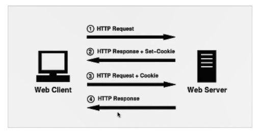

# HTTP

## **超文本传输协议HTTP主要特点：**

- 支持客户/服务器（C/S）模式
- 简单快速
- 灵活
- 无连接
- 无状态

## **请求响应的步骤：**

- 客户端连接到Web服务器
- 发送HTTP请求
- 服务器接受请求并返回HTTP响应
- 释放TCP连接
- 客户端浏览器解析HTML内容

## **浏览器地址栏键入URL，按下回车之后经历的流程：**

- DNS解析
- TCP连接
- 发送HTTP请求
- 服务器处理请求并返回HTTP报文
- 浏览器解析渲染页面
- 连接结束

## **HTTP状态码：**

- 1XX：指示信息--表示请求已接收，继续处理
- 2XX：成功--表示请求已被成功接收、理解、接受
- 3XX：重定向--要完成请求必须进行更进一步的操作
- 4XX：客户端错误--请求有语法错误或请求无法实现
- 5XX：服务器端错误--服务器中为能实现合法的请求

### 常见状态码：

200 OK：正常返回信息

400 Bad Request：客户端请求有语法错误，不能被服务器所理解

401 Unauthorized：请求未经授权，这个状态代码必须和WWW-Authenticate报头域一起使用

403 Forbidden：服务器收到请求，但是拒绝提供服务

404 Not Found：请求资源不存在，eg：输入了错误的URL

500 Internal Server Error：服务器发送不可预期的错误

503 Server Unavailable：服务器当前不能处理客户端的请求，一段时间后可能恢复正常

## Get请求和Post请求的区别：

- Http报文层面：GET将请求信息放在URL，POST放在报文体中
- 数据可层面：GET符合幂等性和安全性，POST不符合
- 其他层面：GET可以被缓存，被存储，而POST不行

## Cookie和Session：

**cookie简介：**

- 是由服务器发给客户端的特殊信息，以文本的形式存放在客户端
- 客户端再次请求的时候，会把cookie回发
- 服务器接收到后，会解析cookie生成与客户端相对应的内容

**cookie的设置以及发送过程：**

**session简介：**

- 服务器端的机制，在服务器上保存的信息
- 解析客户端请求并操作session id，按需保存状态信息

**两者的区别：**

- cookie数据存放在客户的浏览器上，session数据放在服务器上
- session相对于cookie更安全
- 若考虑减轻服务器负担，应当使用cookie

# Socket

socket通信流程

基于TCP的网络应用程序

基于UDP的网络应用程序

