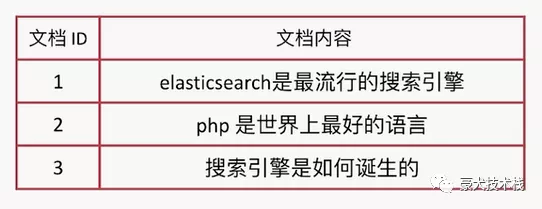
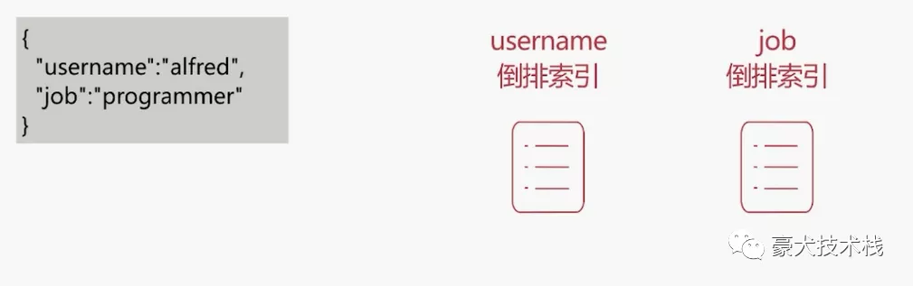

有倒排，那就有正排，先来讲讲正排索引。

如下图所示：

这结构不陌生，我们平时的Mysql、Oracle数据库就是这样存储的。

倒排索引就是反过来：

通过检索单词找到对应的文档ID列表，再根据ID列表正排索引去查找完整数据返回最终结果，达到快速全文检索的效果。

**总结：**

倒排索引是搜索的核心，主要包含两部分：

- 单词词典
- 倒排列表

**单词词典**

- 记录所有文档的单词，一般都比较大。

- 记录单词到倒排列表的关联信息。

- 使用B+树的数据结构，好处：插入跟查询的性能高，充分的利用磁盘跟内存的映射机制。

  

**倒排列表
**

- 记录了单词对应的文档id集合，由倒排索引项（Posting）组成。

  **倒排索引项**

- - 文档id
  - 单词频率，记录该单词在文档中出现的频率，用于后续相关性算分
  - 位置，记录单词在文档中的分词位置，用于做词语搜索
  - 偏移，记录单词在文档的开始和结束位置，用于做高亮显示 

那么词典加倒排列表的整合结构如下：

es存储的是一个json格式的文档，其中包含多个字段，每个字段会有自己的倒排索引：

 