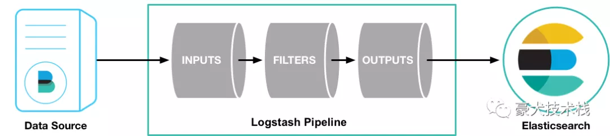

# **什么是 Logstash？**

官方描述：

*Logstash 是开源的服务器端数据处理管道（pipeline ），能够同时从多个来源**采集数据***，**转换数据**，然后将**数据发送**到您最喜欢的存储库中。*

即logstash是管道，主要功能是采集数据，转换数据，发送数据。


## **Logstash pipeline具体怎么实现？**



官方描述：

*A Logstash pipeline has two required elements, `input` and `output`, and one optional element, `filter`. The input plugins consume data from a source, the filter plugins modify the data as you specify, and the output plugins write the data to a destination.*

很简单，logstash管道有两个必须的元素：输入和输出，还有一个非必须的过滤器。输入插件从数据源消费数据，过滤器按你的规定修改数据，输出插件将数据写到指定存储数据的地方。


**`input` 输入**：采集各种样式、大小和来源的数据

数据往往以各种各样的形式，或分散或集中地存在于很多系统中。Logstash 支持 各种输入选择 ，可以在同一时间从众多常用来源捕捉事件。能够以连续的流式传输方式，轻松地从您的日志、指标、Web 应用、数据存储以及各种 AWS 服务采集数据。


**filter 过滤器**：实时解析和转换数据

数据从源传输到存储库的过程中，Logstash 过滤器能够解析各个事件，识别已命名的字段以构建结构，并将它们转换成通用格式，以便更轻松、更快速地分析和实现商业价值。

- 利用 Grok 从非结构化数据中派生出结构
- 从 IP 地址破译出地理坐标
- 将 PII 数据匿名化，完全排除敏感字段
- 简化整体处理，不受数据源、格式或架构的影响

我们的过滤器库丰富多样，拥有无限可能。


**output 输出**：选择您的存储库，导出您的数据

尽管 Elasticsearch 是我们的首选输出方向，能够为我们的搜索和分析带来无限可能，但它并非唯一选择。Logstash 提供众多输出选择，您可以将数据发送到您要指定的地方，并且能够灵活地解锁众多下游用例。


## **使用**

以 logstash 读文件为例，这就用到了input插件里的file插件

1、新建一个logstash.conf文件：

```shell
input{ 
	file{  
		path => "/home/appuser/logstash/txt/logstashTest.txt" 
	}
}
output{ 
	stdout{  
		codec => json 
	}
}
```

*file input 插件只有path参数是必须的，为数据源文件的位置，支持数组*


2、开启管道命令：

```
bin/logstash -f ../../txt/logstash.conf
Settings: Default pipeline workers: 1Pipeline main started
```


3、新开窗口模拟数据添加到数据源文件

```
echo "haha" >> logstashTest.txt
```


4、返回管道窗口，信息按照我们设定的json格式输出了

```
{"message":"haha","@version":"1","@timestamp":"2020-04-26T06:08:36.747Z","path":"/home/appuser/logstash/txt/logstashTest.txt","host":"VM_0_15_centos"}
```


接下来演示filter插件的使用，比如我们要按符号分割，所以要用到CSV filter plugin，以 "?" 来分割（默认是","）：

```shell
input{ 
	file{  
		path => "/home/appuser/logstash/txt/logstashTest.txt" 
	}
}
filter {      
	csv {        
		separator => "?"      
	} 
}
output{ 
	stdout{  
		codec => json 
	}
}
```


输入

```
echo "hello,logstash?world" >> logstashTest.txt
```


输出

```
{"message":"hello,logstash?world","@version":"1","@timestamp":"2020-04-26T06:58:32.592Z","path":"/home/appuser/logstash/txt/logstashTest.txt","host":"VM_0_15_centos","column1":"hello,logstash","column2":"world"}
```


按问号帮我们分割成两个字段

```
"column1":"hello,logstash","column2":"world"
```


更多插件使用请查看官方文档：

**input plugin：**

https://www.elastic.co/guide/en/logstash/current/input-plugins.html

**filter plugin：**

https://www.elastic.co/guide/en/logstash/current/filter-plugins.html

**output plugin：**

https://www.elastic.co/guide/en/logstash/current/output-plugins.html


 