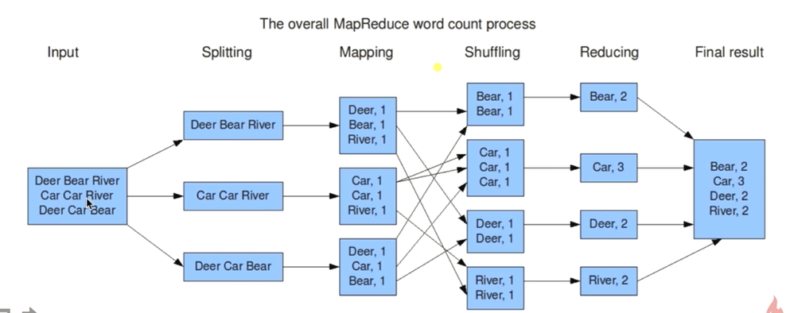
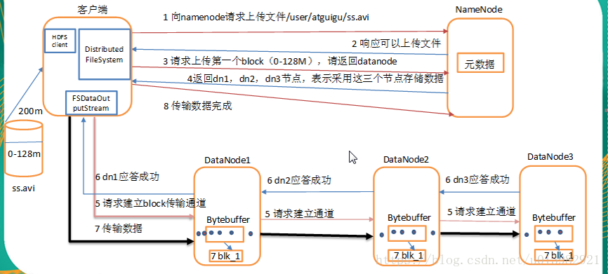
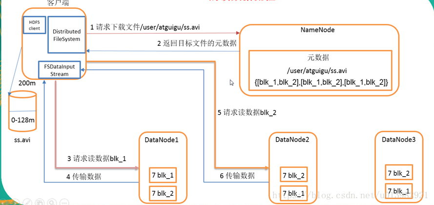

## 简介

Hadoop：提供分布式的存储（一个文件被拆分成很多个块，并且以副本的方式存储在各个节点中）和计算。

分布式文件系统：HDFS 实现将文件分布式存储在很多的服务器上。

分布式计算框架：MapReduce 实现在很多机器上分布式并行计算。

分布式资源调度框架：YARN 实现集群资源管理以及作业的调度。

## 分布式文件系统：HDFS

- 将文件切分成指定大小的数据块并以多副本的存储在多个机器上
- 数据切分、多副本、容错等操作对用户是透明的

## 分布式计算框架：MapReduce



## 分布式资源调度框架：YARN

- YARN：Yet Another Resource Negotiator
- 负责整个集群资源的管理和调度
- YARN特点：扩展性&容错性&多框架资源统一调度

## Hapdoop优势

 **高可靠性**

- 数据存储：数据块多副本
- 数据计算：重新调度作业计算

**高扩展性**

- 存储/计算资源不够时，可以横向的线性扩展机器
- 一个集群中可以包含数以千计的节点

**其他**

- 存储在廉价机器上，降低成本
- 成熟的生态圈

## 安装

1.  https://archive.apache.org/dist/hadoop/common/ 寻找合适的版本下载。

2. 版本：hadoop-3.2.1

3. 配置 /etc/hadoop 目录下的 hadoop-env.sh 的 JAVA_HOME：

   ```
   export JAVA_HOME=/home/appuser/jdk/jdk1.8.0_211
   ```

4. 配置 /etc/hadoop 目录下的core-site.xml的configuration标签：

   ```
   <configuration>
   
   <property>
       <name>fs.defaultFS</name>
       <value>hdfs://master:9000</value>
   </property>
   
   </configuration>
   ```

5. 配置 /etc/hadoop 目录下的hdfs-site.xml的configuration标签：

   ```
   <configuration>
   
   <property>
       <name>dfs.replication</name>
       <value>1</value>
   </property>
   
   <property>
       <name>hadoop.tmp.dir</name>
       <value>/home/appuser/hadoop/tmp/hadoop-${user.name}</value>
   </property>
   
   </configuration>
   ```

6. 配置 /etc/hadoop 目录下的workers：主机名

## 启动

**一键启动：**

第一次执行的时候一定要格式化文件系统：

```
/home/appuser/hadoop/hadoop-3.2.1/bin/hdfs namenode -format
```

启动：

```
/home/appuser/hadoop/hadoop-3.2.1/sbin/start-dfs.sh
```

如果出现jps出现

```
SecondaryNameNode
DataNode
NameNode
```

说明启动成功。

**单个启动：**

```
/home/appuser/hadoop/hadoop-3.2.1/sbin/hadoop-daemons.sh start namenode
/home/appuser/hadoop/hadoop-3.2.1/sbin/hadoop-daemons.sh start datenode
/home/appuser/hadoop/hadoop-3.2.1/sbin/hadoop-daemons.sh start secondarynamenode
```

## 命令行操作

```
Usage: hadoop fs [generic options]
        [-appendToFile <localsrc> ... <dst>]
        [-cat [-ignoreCrc] <src> ...]
        [-checksum <src> ...]
        [-chgrp [-R] GROUP PATH...]
        [-chmod [-R] <MODE[,MODE]... | OCTALMODE> PATH...]
        [-chown [-R] [OWNER][:[GROUP]] PATH...]
        [-copyFromLocal [-f] [-p] [-l] [-d] [-t <thread count>] <localsrc> ... <dst>]
        [-copyToLocal [-f] [-p] [-ignoreCrc] [-crc] <src> ... <localdst>]
        [-count [-q] [-h] [-v] [-t [<storage type>]] [-u] [-x] [-e] <path> ...]
        [-cp [-f] [-p | -p[topax]] [-d] <src> ... <dst>]
        [-createSnapshot <snapshotDir> [<snapshotName>]]
        [-deleteSnapshot <snapshotDir> <snapshotName>]
        [-df [-h] [<path> ...]]
        [-du [-s] [-h] [-v] [-x] <path> ...]
        [-expunge [-immediate]]
        [-find <path> ... <expression> ...]
        [-get [-f] [-p] [-ignoreCrc] [-crc] <src> ... <localdst>]
        [-getfacl [-R] <path>]
        [-getfattr [-R] {-n name | -d} [-e en] <path>]
        [-getmerge [-nl] [-skip-empty-file] <src> <localdst>]
        [-head <file>]
        [-help [cmd ...]]
        [-ls [-C] [-d] [-h] [-q] [-R] [-t] [-S] [-r] [-u] [-e] [<path> ...]]
        [-mkdir [-p] <path> ...]
        [-moveFromLocal <localsrc> ... <dst>]
        [-moveToLocal <src> <localdst>]
        [-mv <src> ... <dst>]
        [-put [-f] [-p] [-l] [-d] <localsrc> ... <dst>]
        [-renameSnapshot <snapshotDir> <oldName> <newName>]
        [-rm [-f] [-r|-R] [-skipTrash] [-safely] <src> ...]
        [-rmdir [--ignore-fail-on-non-empty] <dir> ...]
        [-setfacl [-R] [{-b|-k} {-m|-x <acl_spec>} <path>]|[--set <acl_spec> <path>]]
        [-setfattr {-n name [-v value] | -x name} <path>]
        [-setrep [-R] [-w] <rep> <path> ...]
        [-stat [format] <path> ...]
        [-tail [-f] [-s <sleep interval>] <file>]
        [-test -[defswrz] <path>]
        [-text [-ignoreCrc] <src> ...]
        [-touch [-a] [-m] [-t TIMESTAMP ] [-c] <path> ...]
        [-touchz <path> ...]
        [-truncate [-w] <length> <path> ...]
        [-usage [cmd ...]]
```

## 分布式文件系统HDFS

**HDFS写数据流程图**

 

1）客户端通过Distributed FileSystem模块向namenode请求上传文件，namenode检查目标文件是否已存在，父目录是否存在。

2）namenode返回是否可以上传。

3）客户端请求第一个 block上传到哪几个datanode服务器上。

4）namenode返回3个datanode节点，分别为dn1、dn2、dn3。

5）客户端通过FSDataOutputStream模块请求dn1上传数据，dn1收到请求会继续调用dn2，然后dn2调用dn3，将这个通信管道建立完成。

6）dn1、dn2、dn3逐级应答客户端。

7）客户端开始往dn1上传第一个block（先从磁盘读取数据放到一个本地内存缓存，然后才会写入本地磁盘），以packet为单位，dn1收到一个packet就会传给dn2，dn2传给dn3；dn1每传一个packet会放入一个应答队列等待应答。

8）当一个block传输完成之后，客户端再次请求namenode上传第二个block的服务器。（重复执行3-7步）。

 **HDFS读数据流程图** 

  

1）客户端通过Distributed FileSystem向namenode请求下载文件，namenode通过查询元数据，找到文件块所在的datanode地址。

2）挑选一台datanode（就近原则，然后随机）服务器，请求读取数据。

3）datanode开始传输数据给客户端（从磁盘里面读取数据输入流，以packet为单位来做校验）。

4）客户端以packet为单位接收，先在本地缓存，然后写入目标文件。

## 分布式计算框架 MapReduce

