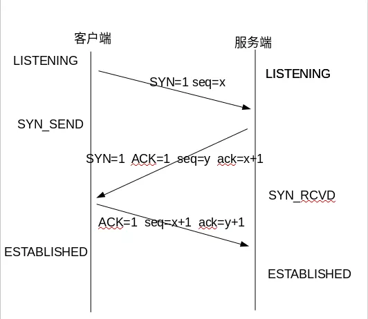
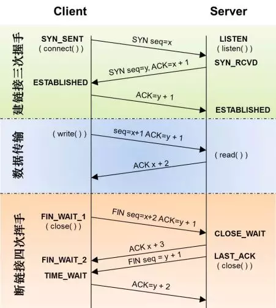

# Java网络编程

**socket之TCP编程实例：**

首先新建TCP服务端

```java
public class TCPServer {
	
	public static void main(String[] args) throws IOException {
		//创建socket，并将socket绑定到65000端口
		ServerSocket ss = new ServerSocket(65000);
		//死循环，使socket一直等待并处理客户端发送过来的请求
		while(true) {
			//监听65000端口，直到客户端返回连接信息后才返回
			Socket socket = ss.accept();
			//获取客户端的请求信息后，执行相关的业务逻辑
			new LengthCalculator(socket).start();
		}
	}
}
```

新建业务类 LengthCalculator

```java
public class LengthCalculator extends Thread{

	private Socket socket;
	
	public LengthCalculator(Socket socket) {
		this.socket  = socket;
	}

	public void run() {
		try {
			OutputStream os  = socket.getOutputStream();//输出流
			InputStream is =  socket.getInputStream();//输入流
			int ch =0;
			byte[] buff = new byte[1024];
			//buff主要用来读取输入的内容，存成byte数组，ch主要用来获取读取数组的长度
			ch = is.read(buff);
			//将接收流的byte数组转换成字符串，这里获取的内容是客户端发送过来的字段
			String content  = new String(buff, 0, ch);
			System.out.println(content);
			//往输出流里写入获得字符串的长度，回发给客户端
			os.write(String.valueOf(content.length()).getBytes());
			
			is.close();
			os.close();
			socket.close();
		}catch(IOException e){
			e.printStackTrace();
		}
	}
}
```

新建TCP客户端

```java
public class TCPClient {
	
	public static void main(String[] args) throws UnknownHostException, IOException {
		Socket socket = new Socket("127.0.0.1",65000);
		//获取输出流
		OutputStream os  = socket.getOutputStream();//输出流
		InputStream is =  socket.getInputStream();//输入流
		//将要传递给server的字符串转换成byte数组，将数组写入到输出流中
		os.write(new String("hello world").getBytes());
		int ch =0;
		byte[] buff = new byte[1024];
		//buff主要用来读取输入的内容，存成byte数组，ch主要用来获取读取数组的长度
		ch = is.read(buff);
		//将接收流的byte数组转换成字符串，这里获取的内容是客户端发送过来的字段
		String content  = new String(buff, 0, ch);
		System.out.println(content);
		//往输出流里写入获得字符串的长度，回发给客户端
		os.write(String.valueOf(content.length()).getBytes());
		
		is.close();
		os.close();
		socket.close();
	}
}
```

依次启动服务类——客户端类，服务端收到客户端发过来的字符串，给客户端返回字符串的长度。


**socket之UDP实例：**

新建UDP服务类

```java
public class UDPServer {
	public static void main(String[] args) throws Exception {
		DatagramSocket socket = new DatagramSocket(65001);//监听的端口号
		byte[] buff = new byte[100];//存储从客户端接收到的内容
		DatagramPacket packet = new DatagramPacket(buff,buff.length);
		//接受客户端发送过来的内容，并将内容封装进DatagramPacket对象中
		socket.receive(packet);
		
		byte[] data = packet.getData();//从DatagramPacket对象中获取到真正存储的数据
		//将数据从二进制转换成字符串形式
		String content = new String(data,0,packet.getLength());
		System.out.println(content);
		//将要发送给客户端的数据转成二进制
		byte[] sendedContent = String.valueOf(content.length()).getBytes();
		//服务端给客户端发送数据报
		//从DatagramPacket对象中获取到数据的来源地址与端口号
		DatagramPacket packetToClient = new DatagramPacket(sendedContent,sendedContent.length,packet.getAddress(),packet.getPort());
		socket.send(packetToClient);//发送数据给客户端
	}
}
```

新建UDP客户端

```java
public class UDPClient {
	public static void main(String[] args) throws Exception {
		//客户端发数据报给服务端
		DatagramSocket socket = new DatagramSocket();
		//要发送给服务端的数据
		byte[] buff = "Hello World".getBytes();
		//将ip地址封装成InetAddress对象
		InetAddress address = InetAddress.getByName("127.0.0.1");
		//将要发送给服务端的数据封装成DatagramPacket对象，需要填写上ip地址与端口号
		DatagramPacket packet = new DatagramPacket(buff, buff.length,address,65001);
		//发送数据给服务端
		socket.send(packet);
		//客户端接受服务端发送过来的数据报
		byte[] data = new byte[100];
		//创建DatagramPacket对象用来存储服务端发送过来的数据
		DatagramPacket receivedPacket = new DatagramPacket(data, data.length);
		//将接收到的数据存储到DatagramPacket对象中
		socket.receive(receivedPacket);
		//将服务器端发送过来的数据取出来
		String content = new String(receivedPacket.getData(),0,receivedPacket.getLength());
		
		System.out.println(content);
	}
}
```

依次启动服务类——客户端类，服务端收到客户端发过来的字符串，给客户端返回字符串的长度。

## 三次握手

### 部分报头信息声明

seq: 序列号，表示数据第一个字节的序号

ack: 确认序列号，表示期望收到的第一个字节的序号

### FLAG位

> 常用的由SYN、ACK、FIN。

SYN：用作建立连接时的同步信号。

ACK：用于对收到的数据进行确认。

FIN：表示后面没有数据需要发送，连接需要关闭。

### 握手过程





第一次握手：客户端发送数据包将SYN置1，表示希望建立连接，seq=x。发完后进入SYN_SEND状态。

第二次握手：服务器收到请求后，通过SYN确认是建立连接请求，然后发送一个响应包，将SYN=1 ACK=1 seq=y ack=x+1,然后进入SYN_RCVDz状态

第三次握手：客户端收到服务器的SYN+ACK包，向服务器发送确认包ACK(ack=y+1)，此包发送完毕，客户端和服务器进入ESTABLISHED状态，完成三次握手。

### 为什么要三次握手？

1. 保持信息对等。
2. 防止请求超时导致脏连接。

### 两次握手会怎样？

如果两次握手就创建连接，传输完数据并释放连接后，第一个超时的连接请求才到达服务器，服务器会认为是客户端创建新连接的请求，然后创建连接。此时客户端的状态不是SYN_SENT，所以会直接丢弃服务器传来的确认数据，导致最后只是服务器单方面建立了连接。

### 四次挥手

> 这个图不好画，网上找了一个。





1. 客户端想要关闭连接，然后发送FIN信号并带上seq信息给服务器，
2. 服务器应答ACK告诉客户端可以断开，但是要等我把数据发送完喽。注意这时候客户端进入FIN_WAIT_2状态。
3. 服务器将数据发送完后发送FIN+ACK给客户端，告诉客户端OK了，然后自己进入CLOSE_WAIT状态。
4. 客户端收到后，给服务器发送ACK确认收到，然后自己进入TIME_WAIT状态。

经过2MSL，客户端没有收到服务器传来的报文，则确定服务器已经收到最后的ACK信号，连接正式释放。

四次挥手白话文：

1. 客户端：我断连接了阿
2. 服务器：噢，好的知道了，不过要等等，我还有一些数据没传完，我传完了告诉你。
3. 服务器：小老弟，我传完了，可以关闭了，收到请回复(没有回复的话我过会重新喊你)
4. 客户端：收到(我得再等等，要确认我哥收到了我的回复)

### 为什么不直接关闭而是进入TIME_WAIT呢？

1. 客户端要确认服务器能收到ACK信号。(如果不确认这一点，服务器会认为客户端没有收到自己的FIN+ACK报文，所以会重发)
2. 防止失效请求。(为了防止已失效的连接的请求数据包和正常的混淆)