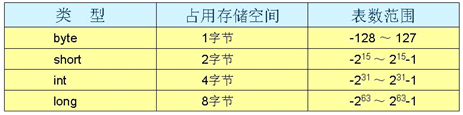
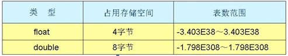

1.JAVA的垮平台原理

```
JVM也是一个软件，不同的平台有不同的版本。我们编写的Java源码，编译后会生成一种 .class 文件，称为字节码文件。Java虚拟机就是负责将字节码文件翻译成特定平台下的机器码然后运行。也就是说，只要在不同平台上安装对应的JVM，就可以运行字节码文件，运行我们编写的Java程序。

而这个过程中，我们编写的Java程序没有做任何改变，仅仅是通过JVM这一”中间层“，就能在不同平台上运行，真正实现了”一次编译，到处运行“的目的。

JVM是一个”桥梁“，是一个”中间件“，是实现跨平台的关键，Java代码首先被编译成字节码文件，再由JVM将字节码文件翻译成机器语言，从而达到运行Java程序的目的。

注意：编译的结果不是生成机器码，而是生成字节码，字节码不能直接运行，必须通过JVM翻译成机器码才能运行。不同平台下编译生成的字节码是一样的，但是由JVM翻译成的机器码却不一样。

所以，运行Java程序必须有JVM的支持，因为编译的结果不是机器码，必须要经过JVM的再次翻译才能执行。即使你将Java程序打包成可执行文件（例如 .exe），仍然需要JVM的支持。

注意：跨平台的是Java程序，不是JVM。JVM是用C/C++开发的，是编译后的机器码，不能跨平台，不同平台下需要安装不同版本的JVM。
```

 2.JAVA中INT占几个字节






```
char 占2个字节
boolean 一个字节(1位)
```

3.JAVA面向对象的特征

```java
封装、抽象、继承和多态。

封装：在面向对象语言中，封装特性是由类来体现的，我们将现实生活中的一类实体定义成类，其中包括属性和行为（在Java中就是方法）.例如电脑,

抽象：抽象就是将一类实体的共同特性抽象出来，封装在一个抽象类中，所以抽象在面向对象语言是由抽象类来体现的。比如人.
class Person{}

继承：继承就像是我们现实生活中的父子关系，儿子可以遗传父亲的一些特性，在面向对象语言中，就是一个类可以继承另一个类的一些特性，从而可以代码重用.
eg:class Zhangsan extends Person{};

多态：多态就是通过传递给父类对象引用不同的子类对象从而表现出不同的行为
eg:Person person=new Zhangsan();
```

41.什么是框架

```
框架(Framework)是一个框子—–具有约束性,也是一个架子—-具有支撑性.
IT语境中的框架,特支为解决一个开放性问题而设计的具有一定约束性的支撑架构.在此结构上可以根据具体问题扩展.安插更多的组成部分.从而更迅速和更方便的构建完整的解决问题的方案.

框架本身一般不完整到可以解决特定问题,但是可以帮助我们快速解决特定问题
框架天生就是为了扩展而设计的
框架里面可以为后续扩展的组件提供很多辅助性,支撑性的方便易用的使用工具.也就是说框架时常配套; 一些帮助解决某类问题的库或工具.
```

 42.简单介绍一下MVC模式

```
MVC全名是model view Controller,是模型(model)—视图(view)—控制器(Controller)的缩写,是一种软件设计典范.
最简单的,最经典的就是jsp(view)+servlet(Controller)+javabean(model)
1.当控制器收到来自用户的请求
2.控制器调用javabean完成业务
3.完成业务后通过控制器跳转jsp页面的方式给用户反馈信息
4.Jsp给用户做出响应
```

43.简单说一下对MVC框架的理解

```
是为了解决传统的MVC模式(jsp+servlet+javabean)问题而出现的框架.

传统MVC模式问题
1.所有的servlet和servlet映射都要配置在web.xml中,如果项目太大,web.xml就太庞大,并且不能实现模块化管理.
2.Servlet的主要功能就是接受参数,调用逻辑,跳转页面,比如像其他字符编码,文件上传等功能也要写在servlet中,不能让servlet功能单一.
3.接受参数比较麻烦,不能通过model接收,只能单个接收,接收完成后转换封装进model.
4.跳转页面方式比较单一(forward,redirect),并且当页面名称发生变化时,需要修改servlet源代码.
常用的MVC框架:struts2,springMVC
```

44.STRUTS2的执行流程或者STRUTS2的原理

```
1.浏览器发送请求,经过一系列的过filter,到达strutsPrepareAndExecuteFilter
2.strutsPrepareAndExecuteFilter通过ActionMapper判断当前的请求是否需要某个Action处理,如果不需要,则走原来的流程.如果需要,把请求交个ActionProxy来处理
3.ActionProxy通过Configuration Manager 询问框架的配置文件struts.xml,找到需要调用的Action类;
4.创建一个ActionInvocation实例,来调用Action的对应方法来获取结果集的name,在调用前后会执行相关拦截器
5.通过结果集的name找到对应的结果集来对浏览器进行响应
```

45.STRUTS2的拦截器是什么

```
通过动态配置方式,可以在执行Action的方法前后,加入相关逻辑,完成业务 .struts2中的功能, 都是通过系统拦截器实现的.比如:参数处理,文件上传,字符编码.当然,我们也可以自定义拦截器
使用场景:用户登陆判断,在执行Action的前面判断是否已经登陆,如果没有登陆则跳转到登陆页面;用户权限的判断,在执行Action的前面判断是否具有权限,如果没有给出提示信息;
```

46.SPRING MVC的执行流程

```
1.用户发送请求,被前端控制器(DispatcherServlet)捕获(捕获请求)
2.前端控制器进行解析,得到URI,通过URI调用HandlerMapping并获得该Handler配置的所有相关对象(查找Handler)
3.前端控制器根据得到的Handler,选择合适的HandlerAdapter,提取Request中的模型数据,填入Handler入参,开始执行Handler,最后返回一个ModelAndView对象.(执行Handler)
4.前端控制器根据返回的ModelAndViewm,选择合适的ViewResolver(选择ViewResolver)
5.通过ViewResolver结合Model和View来渲染视图,前端控制器将渲染结果返回给客户端(渲染并返回)
```

47.SPRINGMVC和STRUTS2的不同

```
核心控制器不同:springmvc是servlet,struts2是filter
控制器实例:springmvc会比struts快(理论上),springmvc是基于方法设计,struts是基于对象,每发一次请求都会实例一个action.springmvc只有一个实例,每次请求执行对应的方法即可,简单来说,springmvc是单例,是strust2是多例
管理方式:springmvc是spring的一个模块,所以spring对于springmvc的控制管理更加简单方便.而struts需要使用xml配置很多参数来管理
参数传递:struts2中自身提供多种参数接收,其实都是通过valuestack进行传递和赋值.而springmvc是通过方法参数进行接收.
interceptor的实现机制:struts有自己的interceptor机制,springmvc用的是独立的aop方式.
Springmvc处理ajax请求,直接返回数据,方法中使用注解@ResponseBody,springmvc自动帮我们将数据转成json数据,而struts2是通过插件的方式进行处理
```

48.简单介绍一下SPRING或者SPRING的两大核心

```
Spring是什么?spring是j2ee应用程序框架,是轻量级的IOC和AOP的容器框架,主要针对javabean的生命周期进行管理的轻量级容器,可以单独使用,也可以跟其它框架组合使用.

IOC(inversion of control)或DI(dependency injection)控制反转
原来:我的service要调用Dao,我就在service中创建Dao对象,这时Dao对象的创建的控制权在我手中
Spring:spring发现我的service依赖于Dao,就给我的service注入Dao对象,这时Dao对象创建的控制权在spring手中
核心原理:工厂模式+反射+配置文件

AOP:面向切面编程
核心原理:使用动态代理的方式在执行前后或出现异常后做相关逻辑.
我们主要使用AOP来做:
事务处理
权限判断
日志记录
```

49.AOP是什么？都用它做什么？

```
AOP:面向切面编程
核心原理:使用动态代理的方式在执行前后或出现异常后做加入相关逻辑.
我们主要使用AOP来做:
事务处理 执行方法前,开启事务,执行方法后提交事务,出现异常后回滚事务
权限判断 在执行方法前,判断是否具有权限
日志记录 在执行方法前执行日志
```

50.SPRING事务的传播特性和隔离级别

> 事务的传播特性:多个事务存在是怎么处理的策略.

| 传播行为                  | **意义**                                                     |
| ------------------------- | ------------------------------------------------------------ |
| PROPAGATION_MANDATORY     | 表示该方法必须运行在一个事务中。如果当前没有事务正在发生，将抛出一个异常 |
| PROPAGATION_NESTED        | 表示如果当前正有一个事务在进行中，则该方法应当运行在一个嵌套式事务中。被嵌套的事务可以独立于封装事务进行提交或回滚。如果封装事务不存在，行为就像PROPAGATION_REQUIRES一样。 |
| PROPAGATION_NEVER         | 表示当前的方法不应该在一个事务中运行。如果一个事务正在进行，则会抛出一个异常。 |
| PROPAGATION_NOT_SUPPORTED | 表示该方法不应该在一个事务中运行。如果一个现有事务正在进行中，它将在该方法的运行期间被挂起。 |
| PROPAGATION_SUPPORTS      | 表示当前方法不需要事务性上下文，但是如果有一个事务已经在运行的话，它也可以在这个事务里运行。 |
| PROPAGATION_REQUIRES_NEW  | 表示当前方法必须在它自己的事务里运行。一个新的事务将被启动，而且如果有一个现有事务在运行的话，则将在这个方法运行期间被挂起。 |
| PROPAGATION_REQUIRES      | 表示当前方法必须在一个事务中运行。如果一个现有事务正在进行中，该方法将在那个事务中运行，否则就要开始一个新事务。 |

| 隔离级别                   | **含义**                                                     |
| -------------------------- | ------------------------------------------------------------ |
| ISOLATION_DEFAULT          | 使用后端数据库默认的隔离级别。                               |
| ISOLATION_READ_UNCOMMITTED | 允许读取尚未提交的更改。可能导致脏读、幻影读或不可重复读。   |
| ISOLATION_READ_COMMITTED   | 允许从已经提交的并发事务读取。可防止脏读，但幻影读和不可重复读仍可能会发生。 |
| ISOLATION_REPEATABLE_READ  | 对相同字段的多次读取的结果是一致的，除非数据被当前事务本身改变。可防止脏读和不可重复读，但幻影读仍可能发生。 |
| ISOLATION_SERIALIZABLE     | 完全服从ACID的隔离级别，确保不发生脏读、不可重复读和幻影读。这在所有隔离级别中也是最慢的，因为它通常是通过完全锁定当前事务所涉及的数据表来完成的。 |

51.ORM是什么？ORM框架是什么？

```
对象关系映射（Object Relational Mapping，简称ORM）模式是一种为了解决面向对象与关系数据库存在的互不匹配的现象的技术。简单来说，将程序中的兑现自动持久化到关系数据库中。那么，到底如何实现持久化呢？一种简单的反感是采用硬编码的方式（jdbc操作sql方式），为每一种可能的数据库访问操作提供单独的方法。这种方法存在很多缺陷，所以使用ORM框架（为了解决面型对象与关系数据库存在的互不匹配的现象的框架）来解决。

Java典型的ORM框架有：Hibernate，mybatits
```

52.MYBATIS和HIBERNATE有什么不同

```
相同:都是java中的orm框架,屏蔽jdbc的api底层访问细节,使我们不用与jdbc的api打交道,就可以完成对数据的持久化操作.jdbc的api编程流程固定,还将sql与java代码混在在一起,经常需要拼凑sql语句,细节繁琐,开发不方便.
Mybatis的好处:屏蔽jdbc api的底层访问细节,将sql语句域java代码分离,提供将结果集自动封装为实体对象和对象的集合的功能,queryForList返回对象集合.用queryForObject返回单个对象.提供自动将实体对象的属性传递给sql语句的参数
Hibernate的好处:hibernate是一个全自动的orm映射工具,它可以自动生成sql语句,执行并返回java结果.

不同点:
1. hibernate要比mybatis功能强大很多,因为hibernate自动生成sql语句.
2. Mybatis需要我们自己在xml配置文件中写sql语句,hibernate我们无法直接控制该语句,我们就无法去写特定的高效的sql,对于一些不太复杂的sql查询,hibernate可以很好帮我们完成.但是,对于特别复杂的查询,hibernate就很难适应了,这时候用mybatis就是不错的选择,因为mybatis还是由我们自己写sql语句.mybatis可以处理复杂语句,而hibernate不能.
3. Mybatis要比hibernate简单的多,mybatis是面向sql的,不用考虑对象间一些复杂的映射关系.
```

53.HIBERNATE对象状态及其转换

```
瞬时态:刚new的,没有持久化,不在session中
持久态:session中的持久化对象
脱管态:不在session中的持久化对象
```

54.HIBERNATE的缓存

```
缓存:为了提高访问速度,把磁盘或数据库访问变成内存访问.
一级缓存(session缓存):session缓存内置不能被卸载session:是事务范围的缓存(session对象的生命周期通常对应一个数据库事务或者一个应用事务).一级缓存中,持久化类的每个实例都具有唯一的oid
二级缓存(SessionFactory缓存):由于SessionFactory对象的生命周期和一个用程序的整个过程对应,因此hibernate二级缓存是进程范围或者集群范围的缓存,有可能出现并发问题,因此需要采用适当的并发访问策略,该策略为被缓存的数据提供了事务隔离级别.二级缓存是可选的,是一个可配置的插件,默认下SessionFactory不会启用这个插件.

概括:hibernate中的缓存分一级缓存和二级缓存
一级缓存就是session级别的缓存, 在事务范围内是有效的,是内置的不能被卸载.二级缓存是SessionFactory级别的缓存,从应用启动到应用结束有效,是可选的,默认没有二级缓存,需要手动开启

保存数据库后,在内存中保存一份,如果更新了数据库就要同步更新缓存
什么样的数据适合放到缓存中(访问频率,读写比例,数据一致性):
很少被修改的数据
经常被查询的数据
不是很重要的数据,允许出现偶尔并发的数据
不会被并发访问的数据
常量数据

Hibernate的二级缓存默认是不支持分布式缓存的,使用memcache,redis等重要缓存来代替二级缓存
```

55.WEBSERVICE的使用场景

```
Webservice是一个SOA(面向服务的编程)的架构,它是不依赖于语言,不依赖于平台,可以实现不同的语言间的相互调用,通过Internet进行基于http协议的网络应用间的交互.

异构系统(语言)的整合
不同客户端的整合,浏览器 手机端 pc端等终端的访问
例子:
天气预报:可以通过实现webservice客户端调用远程天气服务实现的.
单点登录:一个服务器实现所有系统的登陆
```

56.ACTIVITI的简单介绍

```
Activiti是一个业务流程管理(BPM)和工作流系统,适用于开发人员和系统管理人员,其核心是超快速,稳定的BPMN2流程引擎,它易与spring集成使用.

主要用在OA中,把线下流程放到线上,把现实生活中的一些流程固话定义到系统中,然后通过输入表单数据完成业务.
```

57.LINUX的使用场景

```
Linux是一个长时间运行比较稳定的操作系统,所以我们一般会拿它作为服务器(web,db.app等).
Linux本身具有c的编译环境.我们的一些软件是没有软件包的(redis,nginx),需要在linux编译得到软件包
```

58.LINUX常用命令

```
Cd跳转到目录
Pwd 获取当前路径
Su 切换用户
Ll 查看当前目录下文件和目录
Tail 查看文件
Rm –rf 删除文件
Vi 修改文件
Mv 移动/重命名 文件或文件夹
Mkdir 创建文件夹
Rm –f 删除文件夹
Tar 打包/解压
Grep 查找想要的信息
```

59.怎么操作LINUX服务器

```
需要依赖于linux服务器安装ssh服务端,一般这个ssh服务的端口为22,
需要依赖于linux服务器安装sftp服务端,一般这个sftp服务的端口为25,

使用ssh客户端连接linux服务器,通过命令操作linux服务器
使用sftp客户端来连接sftp服务端,来上传和下载文件(安装包,修改文件上传)
```

60.有没有使用过云主机

```
使用过阿里云
云主机:就是一些云服务运营商(阿里,华为,新浪等)提供的远程服务器功能,我们公司只要付费就可以租用对应的服务器.
```

61.数据库优化方面的事情

```
定位:查找,定位慢查询,并优化
优化
1.创建索引:创建合适的索引,我们就可以在索引中查询,查询到以后直接找对应的额记录
2,分表:当一张表的数据比较多或者一张表的某些字段的值比较多并且很少使用时,采用水平分表或垂直分表来优化,比如spu表
3,读写分离:当一台服务器不能满足需要时,采用将读写分离的方式进行集群
4.缓存:使用redis来进行缓存
```

62.如果查询和定位慢查询

```
在项目自验或项目转测之前,在启动mysql数据库时开启慢查询,并且把执行慢的语句写到日志中,在运行一定的时间后,通过查看日志,找到对应的慢查询信息.

使用EXPLAIN +慢查询语句,来详细分析语句的问题.
```

63.数据库优化之数据库表设计遵循范式

```
三范式:首先符合1nf,才能满足2nf,进一步满足3nf
反三范式:没有冗余的数据库未必是最好的数据库,有事为了提高运行效率,就必须降低范式标准,适当保留冗余数据.具体做法是,在概念数据模型设计时遵守三范式,降低方式标准的工作放到物理数据模型设计时考虑,降低范式就是增加字段,允许冗余.订单和订单项,相册浏览次数和照片的浏览次数.
```

64.选择合适的数据库引擎

```
Myisam存储引擎:如果表对事物要求不高,同时是以查询和添加为主的,我们考虑使用myisam存储引擎,比如论坛中的发帖表,回复表

Innodb存储引擎:对事物要求高,保存的数据都是重要数据.我们建议使用innodb,比如订单表,账号表

Myisam和innodb的区别:
1. 事务安全,myisam不支持使用,而innodb支持
2. 查询和添加速度,myisam不用支持事务就不用考虑同步锁,查找和添加的速度快
3. 支持全文索引,myisam支持,innodb不支持
4. 锁机制:myisam支持表锁,innodb支持行锁
5. 外键:myisam不支持外键,innodb支持外键
```

65.选择合适的索引

```
索引是帮助DBMS高效获取数据的数据结构.
分类:普通索引,唯一索引,主键索引,全文索引
1.普通索引:允许重复的值出现
2.唯一索引:除了不能有重复的记录外,其它和普通索引一样.(用户名;用户身份证;手机号)
3.主键索引:是随着设定主键而创建的;也就是把某个列设为主键的时候,数据库就会给该列创建索引;唯一且没有null值
4.全文索引:用来对表中文本域(char,varchar,text)进行索引,全文索引针对myisam
```

66.使用索引的一些技巧

```
索引弊端:
1. 占用磁盘空间.
2. 对dml(插入,修改.删除)操作有影响,变慢
使用场景:
1. 肯定在where条件经常使用,如果不做查询就没有意义
2. 该字段的内容不是唯一的几个值(sex).
3. 字段内容不是频繁变化

具体技巧:
1. 对于创建的多列索引(复合索引),不是使用的第一部分就不会使用索引(最左匹配)
2. 对于使用like查询,查询如果是”%aaa”不会使用到索引,而”aaa%”会使用到索引
3. 如果条件中有or,有条件没有使用索引,即使其中有条件带索引,也不会使用.简单来说,就是要求使用的所有字段,都必须单独使用时才能使用索引.
4. 如果列类型是字符串,拿一定要在条件中将数据使用引号引用起来,否则索引失效
5. 如果mysql估计使用全表扫描要比索引快,则不适用索引.例子:表里只有一条记录
```

73.REDIS的使用场景

```
缓存:把经常需要查询很少修改的数据放到读速度很快的空间(内存),以便减少下次访问时间,减轻db压力,
计数器:redis中的计数器是原子性的内存操作,可以解决库存溢出问题,进销存,系统存溢出
Session缓存服务器:web集群时作为session的缓存服务器
```

74.REDIS存储对象的方式

```
Json字符串:需要把对象转换成json字符串,当做字符串处理,直接使用set和get来设置或获取/
优点:设置和获取比较简单
缺点:没有提供专门的方法,需要把对象转换成json

字节:需要做序列号,就是把对象序列化为字节保存.

如果是担心json转对象会消耗资源的情况,这个问题需要考量几个地方,
1. 使用的json转换lib是否就会存在性能问题
2. 数据的数据量级别,如果是存储百万级的大数据对象,建议采用存储序列化对象方式.如果是少量的数据级对象,或者是数据对象字段不多,还是建议采用json转换成string方式.毕竟redis对存储字符类型这部分优化的非常好.具体采用的方式与方法,还要看你所使用的场景
```

75.REDIS数据淘汰机制

```
在 redis 中，允许用户设置最大使用内存大小 server.maxmemory，在内存限定的情况下是很有用的。譬如，在一台 8G 机子上部署了 4 个 redis 服务点，每一个服务点分配 1.5G 的内存大小，减少内存紧张的情况，由此获取更为稳健的服务。

内存大小有限,需要保存有效的数据?
Redis内存数据集大小上升到一定大小的时候,就会施行平台策略.数据淘汰策略.redis提供6种数据淘汰策略：
1.volatile-lru：从已设置过期时间的数据集（server.db[i].expires）中挑选最近最少使用的数据淘汰
2.volatile-ttl：从已设置过期时间的数据集（server.db[i].expires）中挑选将要过期的数据淘汰
3.volatile-random：从已设置过期时间的数据集（server.db[i].expires）中任意选择数据淘汰
4.allkeys-lru：从数据集（server.db[i].dict）中挑选最近最少使用的数据淘汰
5.allkeys-random：从数据集（server.db[i].dict）中任意选择数据淘汰
6.no-enviction（驱逐）：禁止驱逐数据
```

76.JAVA访问REDIS级REDIS集群

```
Java访问redis:
1. 使用jedisjava客户端来访问redis服务器,优点类似jdbc访问db一样
2. 如果是spring进行集成时,可以使用springDataRedis来访问redis , springDataRedis 只是对jedis的二次封装

Redis集群:当一台数据无法满足要求,可以使用redis集群来出来,类似mysql的读写分离
```

77.项目的并发

```
1.需求:用户量,这个客户说了算,大概也就是1-5年内用户总量
2.根据pv(页面点击量,浏览量)和uv(ip数量)预估,大致能达到多大的并发量.我们的项目大概能达到1000-3000的并发量
3.确定我们的服务器数量,我们使用的是tomcat,tomcat的默认线程数150,我们可以将它优化调到400左右.而我们大致需要5台web服务器
4.重要的因素(硬件服务器水平—去IOE),我们没有做这个,因为我们没钱.
```

78.http协议

```
1.无状态,为了解决http无状态问题,引入cookie技术
2.http1.0是短连接,http1.1是长连接
3.http协议是基于B/S请求-应答模式
```

79.cookie和session

```
1.Cookie是由服务器创建的,通过response对象的addCookie(Cookie cookie)方法写回客户端,存储在客户端的会话技术.key-value的结构
2.session是基于cookie,session的创建是由服务器做,可以通过request.getSession()获取(要从你的请求中找一个cookie—Jessionid,如果能找到这个cookie,他会拿着这个cookie的值去跟服务器端的session的id比较,如果找到相应的session,就不创建session.如果找不到相应的session,会创建session).session一旦创建就会有一个id属性(唯一的),通过response以cookie的方式写回客户端(这个cookie就叫做就sessionid).

会话:会话就是简单的理解成打开浏览器(包含了一次请求或多次请求).
```

80.session共享的方案

```
1.广播:会造成内网网络风暴,大量占用内网宽带
2.IP_hash:在nginx中配置和,相同的ip找固定的同一台服务器,这种方案会造成服务能力差
3.使用第三方中间件(数据库,redis),我们是使用redis
```

