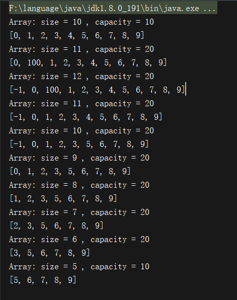
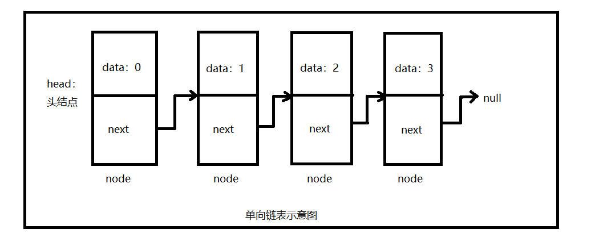
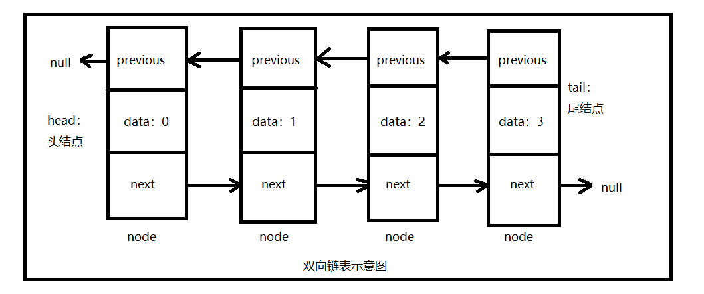
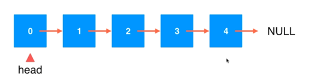
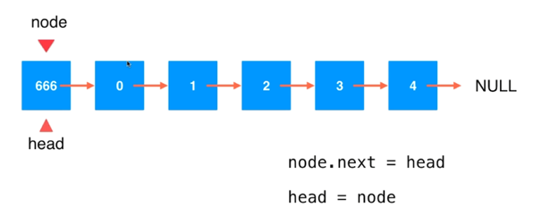
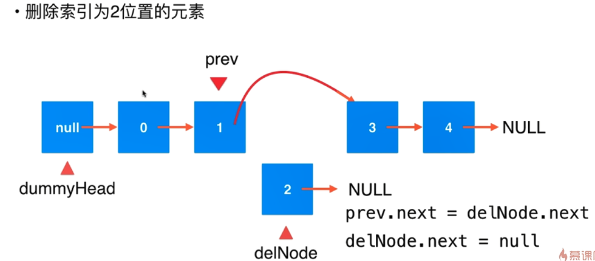

# 数据结构

一般分为三种结构：

- 线性结构——数组、栈、队列、链表、哈希表 ......
- 树结构——二叉树、二分搜索树、AVL、红黑树、Treap、Splay、堆、Trie、线段树、K-D树、并查集、哈夫曼树 ......
- 图结构——邻接矩阵、邻接表

## 时间复杂度分析

O(1)、O(n)、O(lgn)、O(nlogn)、O(n^2)

O描述的是算法的运行时间和输入数据之间的关系

## 数组 Array

 是一种线性表数据结构。它用一组连续的内存空间，来存储一组具有相同类型的数据。 

```java
public class Array<E> {

    private E[] data;
    private int size;

    // 构造函数，传入数组的容量capacity构造Array
    public Array(int capacity){
        data = (E[])new Object[capacity];
        size = 0;
    }

    // 无参数的构造函数，默认数组的容量capacity=10
    public Array(){
        this(10);
    }

    // 获取数组的容量
    public int getCapacity(){
        return data.length;
    }

    // 获取数组中的元素个数
    public int getSize(){
        return size;
    }

    // 返回数组是否为空
    public boolean isEmpty(){
        return size == 0;
    }

    // 在index索引的位置插入一个新元素e
    public void add(int index, E e){

        if(index < 0 || index > size)
            throw new IllegalArgumentException("Add failed. Require index >= 0 and index <= size.");

        if(size == data.length)
            resize(2 * data.length);

        for(int i = size - 1; i >= index ; i --)
            data[i + 1] = data[i];

        data[index] = e;

        size ++;
    }

    // 向所有元素后添加一个新元素
    public void addLast(E e){
        add(size, e);
    }

    // 在所有元素前添加一个新元素
    public void addFirst(E e){
        add(0, e);
    }

    // 获取index索引位置的元素
    public E get(int index){
        if(index < 0 || index >= size)
            throw new IllegalArgumentException("Get failed. Index is illegal.");
        return data[index];
    }

    // 修改index索引位置的元素为e
    public void set(int index, E e){
        if(index < 0 || index >= size)
            throw new IllegalArgumentException("Set failed. Index is illegal.");
        data[index] = e;
    }

    // 查找数组中是否有元素e
    public boolean contains(E e){
        for(int i = 0 ; i < size ; i ++){
            if(data[i].equals(e))
                return true;
        }
        return false;
    }

    // 查找数组中元素e所在的索引，如果不存在元素e，则返回-1
    public int find(E e){
        for(int i = 0 ; i < size ; i ++){
            if(data[i].equals(e))
                return i;
        }
        return -1;
    }

    // 从数组中删除index位置的元素, 返回删除的元素
    public E remove(int index){
        if(index < 0 || index >= size)
            throw new IllegalArgumentException("Remove failed. Index is illegal.");

        E ret = data[index];
        for(int i = index + 1 ; i < size ; i ++)
            data[i - 1] = data[i];
        size --;
        data[size] = null; // loitering objects != memory leak

        if(size == data.length / 4 && data.length / 2 != 0)
            resize(data.length / 2);
        return ret;
    }

    // 从数组中删除第一个元素, 返回删除的元素
    public E removeFirst(){
        return remove(0);
    }

    // 从数组中删除最后一个元素, 返回删除的元素
    public E removeLast(){
        return remove(size - 1);
    }

    // 从数组中删除元素e
    public void removeElement(E e){
        int index = find(e);
        if(index != -1)
            remove(index);
    }

    @Override
    public String toString(){

        StringBuilder res = new StringBuilder();
        res.append(String.format("Array: size = %d , capacity = %d\n", size, data.length));
        res.append('[');
        for(int i = 0 ; i < size ; i ++){
            res.append(data[i]);
            if(i != size - 1)
                res.append(", ");
        }
        res.append(']');
        return res.toString();
    }

    // 将数组空间的容量变成newCapacity大小
    private void resize(int newCapacity){

        E[] newData = (E[])new Object[newCapacity];
        for(int i = 0 ; i < size ; i ++)
            newData[i] = data[i];
        data = newData;
    }
}
```

测试

```java
public class Main {

    public static void main(String[] args) {

        Array<Integer> arr = new Array<>();
        for(int i = 0 ; i < 10 ; i ++)
            arr.addLast(i);
        System.out.println(arr);

        arr.add(1, 100);
        System.out.println(arr);

        arr.addFirst(-1);
        System.out.println(arr);

        arr.remove(2);
        System.out.println(arr);

        arr.removeElement(4);
        System.out.println(arr);

        arr.removeFirst();
        System.out.println(arr);

        for(int i = 0 ; i < 4 ; i ++){
            arr.removeFirst();
            System.out.println(arr);
        }
    }
}
```

结果



## 栈 Stack

- 栈是一种线性结构
- 相比数组，栈对应的操作是数组的子集
- 只能从一端添加元素，也只能从一端取出元素
- 这一端称为栈顶
- 栈是一种后进先出的数据结构（Last In First Out）

应用：

- 无处不在的Undo操作（撤销）
- 程序调用的系统栈
- 括号匹配 - 编译器

**算法实例：有效的括号**

给定一个只包括 '('，')'，'{'，'}'，'['，']' 的字符串，判断字符串是否有效。

有效字符串需满足：

- 左括号必须用相同类型的右括号闭合。
- 左括号必须以正确的顺序闭合。
- 注意空字符串可被认为是有效字符串。

```java
class Solution {
   	public boolean isValid(String s) {
		
		Stack<Character> stack = new Stack<>();
		for(int i=0;i<s.length();i++) {
			char c = s.charAt(i);
			if(c=='(' || c=='[' || c=='{') {
				stack.push(c);//入栈：先把左边括号存进栈
			}else {//判断右边括号
				if(stack.isEmpty()) {//如果字符串没有一个左边括号返回false
					return false;
				}else {//开始匹配
					
					char topChar = stack.pop();//出栈
					if(c==')' && topChar!='(' ) {
						return false;
					}if(c==']' && topChar!='[' ) {
						return false;
					}if(c=='}' && topChar!='{' ) {
						return false;
					}
				}
			}
		}
		
		return stack.isEmpty();
    }
}
```

**Java Stack类常用方法：**

-  boolean empty()  测试堆栈是否为空。
-  Object peek( ) 查看堆栈顶部的对象，但不从堆栈中移除它。 
-  Object pop( ) 移除堆栈顶部的对象，并作为此函数的值返回该对象。 
-  Object push(Object element) 把项压入堆栈顶部。 
-  int search(Object element) 返回对象在堆栈中的位置，以 1 为基数，即栈顶为1，往下递增。 

## 队列 Queue

- 队列也是一种线性结构
- 相比数组，队列对应的操作是数组的子集
- 是一种先进先出的数据结构（First In First Out）

**Java Queue类常用方法：**

- void enqueue（E） 入队
- E dequeue（） 出队
- E getFront（）查看队首的元素
- int getSize（）队列排了多少元素
- boolean isEmpty（）队列是否为空

## 链表 Linked List

数据存储在“节点”（Node）中

 

  




**在链表头添加元素**



**在链表中间添加元素**


**在链表中删除元素**



## 递归

本质上，将原来的问题，转化为更小的同一问题

代码实例：

```java
public class Sum {
	
	private int sum(int[] arr,int l) {
		if(arr.length == l) {
			return 0;//值为6，一般用在主函数结束时，按照程序开发的一般惯例，表示成功完成本函数。
			//return -1;//值为5，一般用在主函数结束时，按照程序开发的一般惯例，表示成功完成本函数。
			//return 1;//值为7，一般用在主函数结束时，按照程序开发的一般惯例，表示成功完成本函数。
		}
		return arr[l] + sum(arr,l+1);
	}
	
	public static void main(String[] args) {
		int[] nums = new int[]{3,1,2};
		System.out.println(new Sum().sum(nums, 0));
	}
}
```

## 二叉树

和链表一样，动态数据结构

```
class Node{
	E e;
	Node left;
	Node right;
}
```

