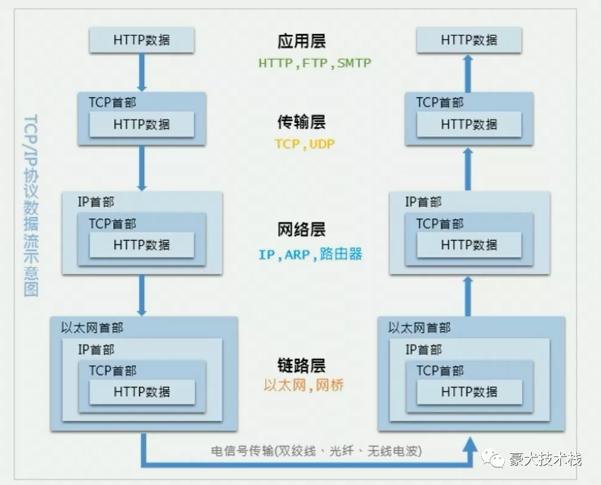
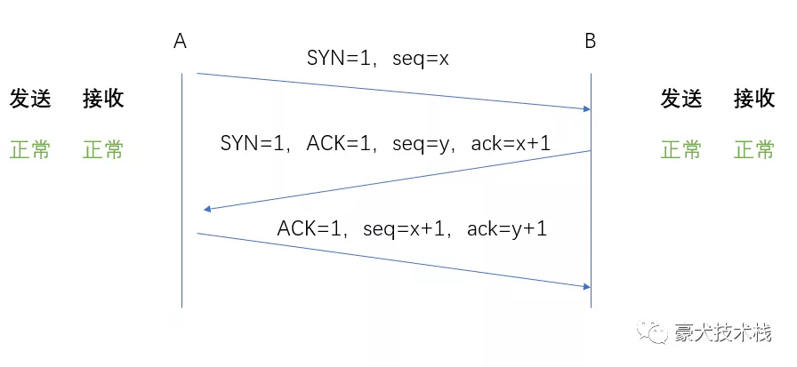
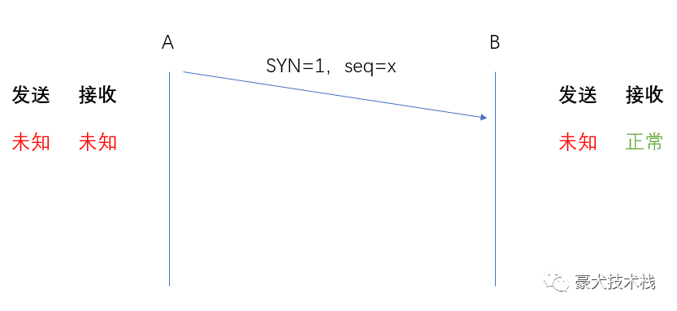
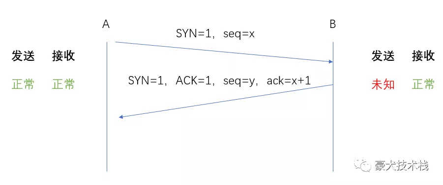

传输控制协议（TCP，Transmission Control Protocol）是一种面向连接的、可靠的、基于字节流的传输层通信协议。

既然是面向连接，那么在发送数据前就要先建立连接，这样才能保住可靠，也就是“三次握手”的由来。

TCP 位于 TCP/IP协议族 的传输层，如图所示：

传输层的功能是负责两台计算机之间的数据传输，也就是 **发送** 跟 **接收** 能力，“三次握手”（如下图）也就是围绕着这两点来展开。

“三次握手”

先来看官话版

**第一次握手**：客户端发送带有SYN标志的连接请求报文段，然后进入SYN_SEND状态，等待服务端的确认。

**第二次握手**：服务端接收到客户端的SYN报文段后，需要发送ACK信息对这个SYN报文段进行确认。同时，还要发送自己的SYN信息。服务端会将上述的信息放在一个报文段（SYN+ACK报文段）中，一并发送给客户端，此时服务端将会进入SYN_RECV状态。

**第三次握手**：客户端接收到服务端的SYN+ACK报文段后，会向服务端发送ACK确认报文段，这个报文段发送完毕后，客户端跟服务端都进入Established状态，完成TCP三次握手。

按大白话说就是：

有A跟B，两人为了确定自己手机的【发送】跟【接收】功能是否正常，需要经过以下三次确认：

**第一次握手**：A发送了一条信息（seq=x），在B回复之前，A对自己的发送跟接收是未知，他只知道自己发出去了，但是B收到没他不清楚；但是至少B知道自己的接收功能是正常的。

**第二次握手**：B向A发了短信（seq=y），顺带A之前的信息（ack=x+1）一起传了过去，至此，A知道了自己的发送跟接收是没问题的了；为了让B知道他自己的发送功能没问题，A还需要回复短信（seq=x+1），顺带B发过来的信息（seq

=y）。

**第三次握手**：B收到A的回复（seq=x+1）后，看到了他发给A的消息（ack=y+1）也带过来了，那说明他之前的发送功能是正常的。

**总结**：“三次握手”的过程也就是**发送端**跟**接收端**确认双方**发送**跟**接收**功能是否正常的过程。

